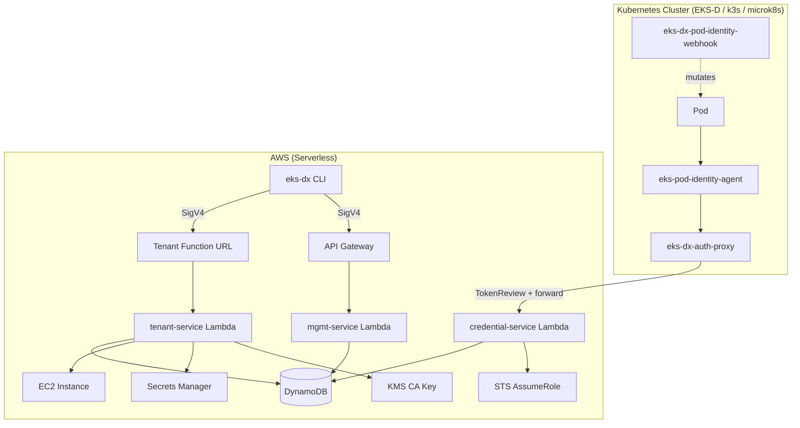
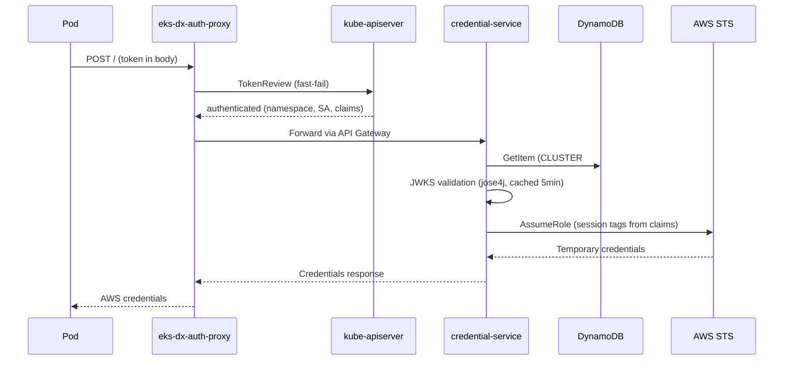
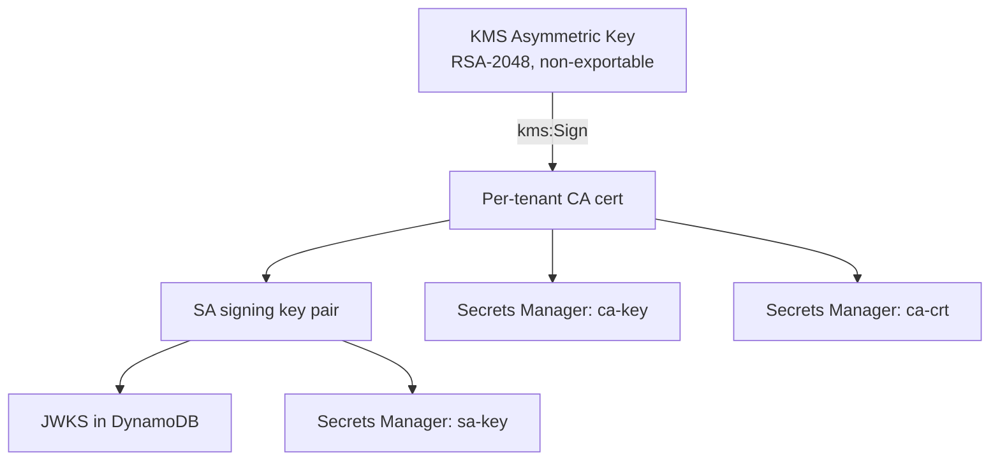

# Architecture

## System Overview

EKS-DX brings EKS Pod Identity to non-EKS Kubernetes clusters through a serverless Lambda backend. Three Lambdas handle credential exchange, cluster management, and tenant provisioning.

## Credential Exchange Flow

## Deployment Topology

| Component | Runtime | Memory | Timeout | Auth |
|-----------|---------|--------|---------|------|
| credential-service | JVM (SnapStart) | 512MB | 30s | None (token-validated) |
| mgmt-service | JVM | 256MB | 30s | IAM SigV4 (API GW) |
| tenant-service | JVM or native arm64 | 256-512MB | 900s | IAM SigV4 (Function URL) |
| eks-dx-auth-proxy | Container (in-cluster) | — | — | K8s ServiceAccount |
| eks-dx-pod-identity-webhook | Container (in-cluster) | — | — | cert-manager TLS |

## PKI Trust Hierarchy (Managed Mode)

