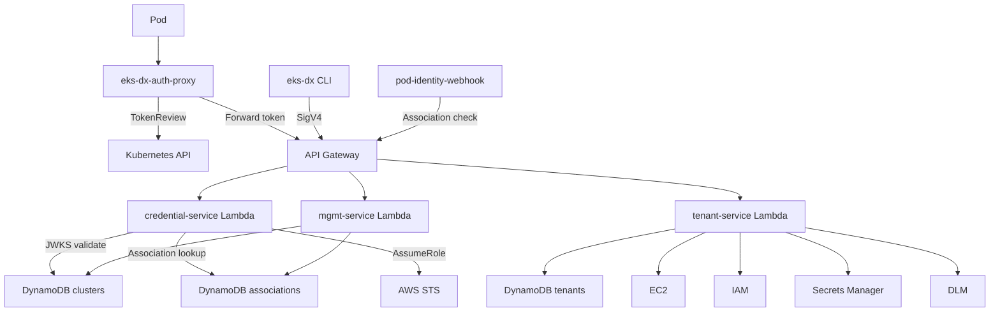
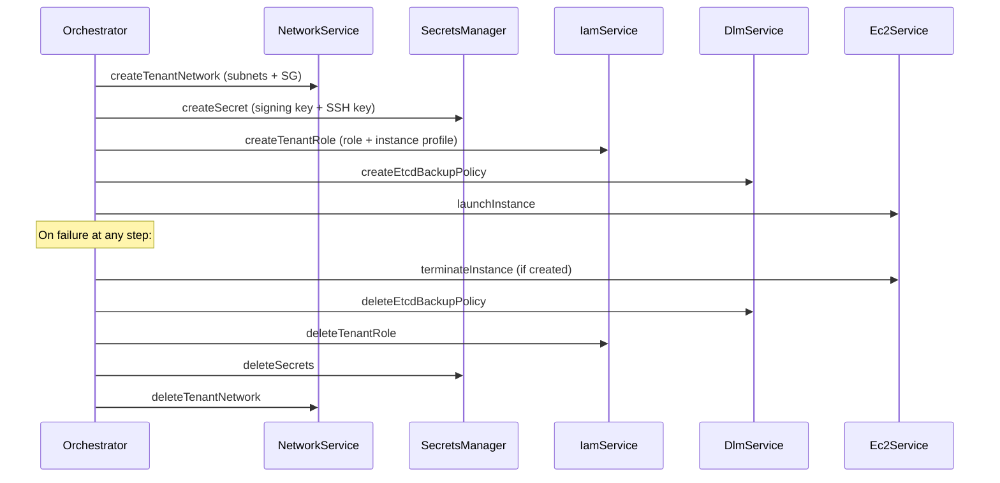

# Architecture

## System Overview

## Three-Lambda Split

| Lambda | Profile | Why Separate |
|--------|---------|--------------|
| credential-service | SnapStart, 512MB, 30s | Hot path, low latency, high concurrency |
| mgmt-service | JVM, 256MB, 30s | CRUD, infrequent, simple |
| tenant-service | Native arm64, 128MB, 900s | Long-running provisioning, cold start matters less |

## Tenant Provisioning — Composable with Rollback

## SSM as Interface

Infrastructure stack writes parameters, Lambda reads at runtime:
- `/eks-dx/launch-template/{arch}/{spot|ondemand}` — Launch template IDs
- `/eks-dx/ami/{arch}/{k8s-version}` — AMI IDs
- `/eks-dx/network/vpc-id`, `private-subnet-ids`, `security-group-id`

## IAM Model

- Tenant-service role: EC2 (scoped to VPC for networking, broad for instances), IAM (scoped to `eks-dx-tenant-*`), Secrets Manager, DLM, STS, SSM, DynamoDB
- Credential-service role: DynamoDB read, STS AssumeRole (scoped to `eks-dx-pod-*`)
- Mgmt-service role: DynamoDB read/write, IAM GetRole (validation)
