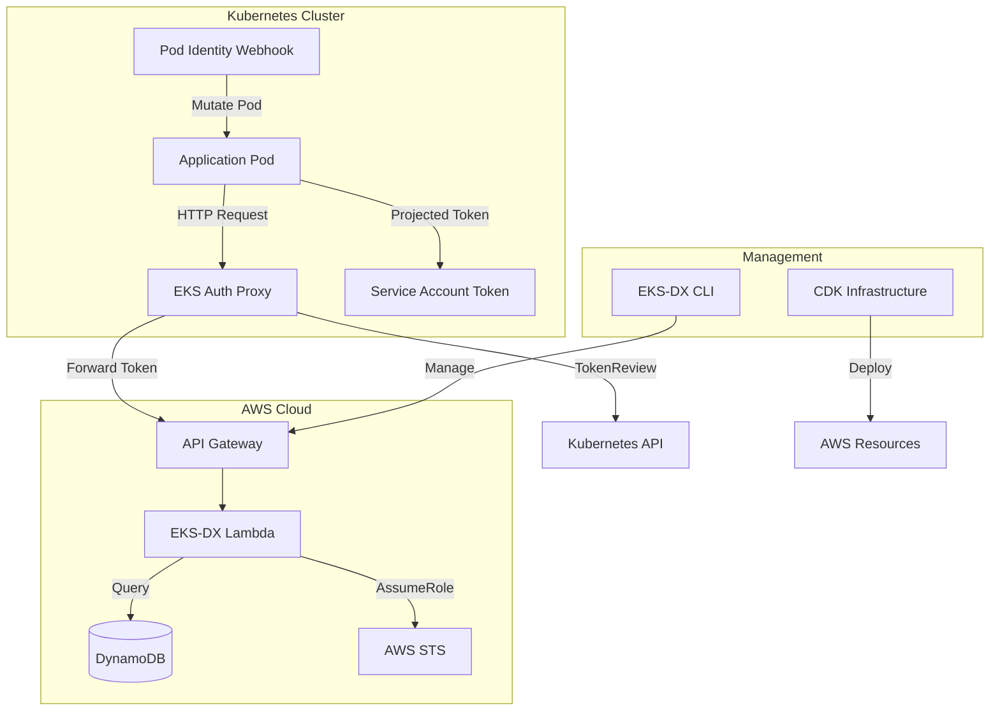
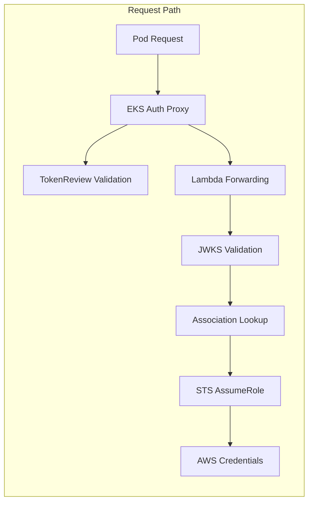
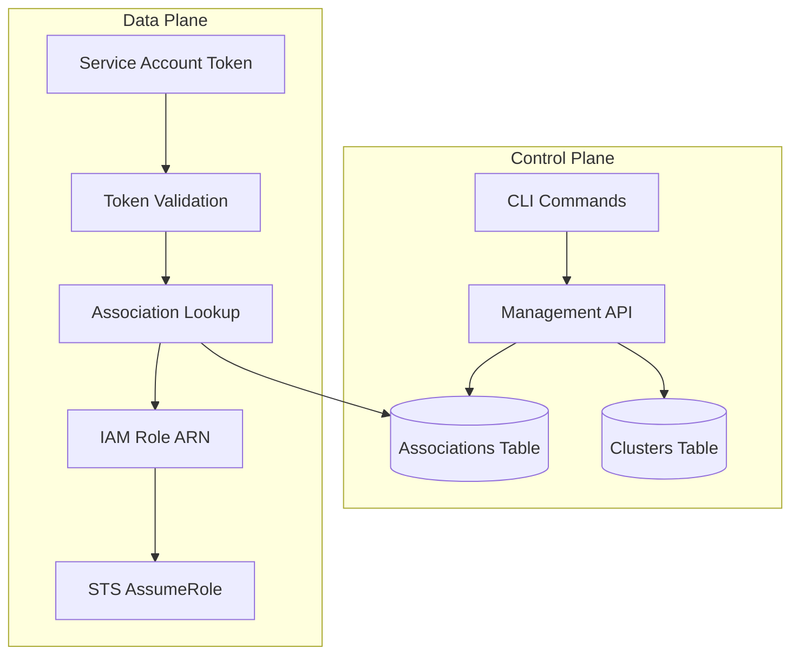
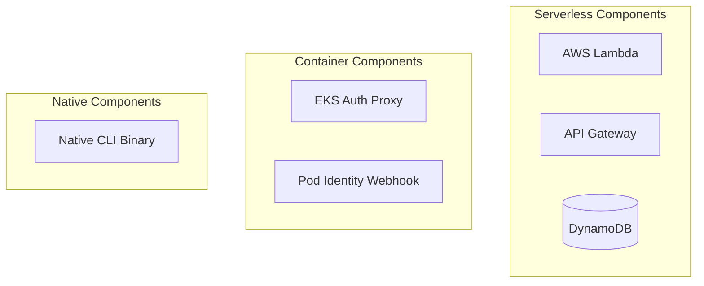
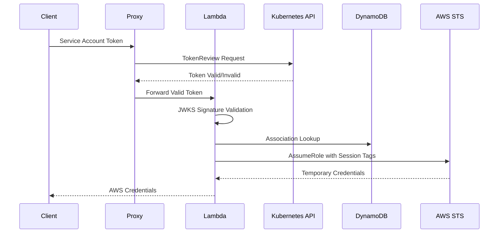

# System Architecture

## Overview
EKS-DX Control Plane implements a distributed authentication system that replicates AWS EKS Pod Identity for non-EKS Kubernetes environments. The architecture follows a microservices pattern with serverless backend components.

## High-Level Architecture

## Component Architecture

### Authentication Flow Components

### Data Flow Architecture

## Design Patterns

### Microservices Pattern
- **Service Separation**: Each component has a single responsibility
- **Independent Deployment**: Components can be deployed separately
- **Technology Diversity**: Different components use optimal technologies

### Event-Driven Architecture
- **Stateless Components**: No local state, all data in DynamoDB
- **Async Processing**: Non-blocking HTTP clients
- **Reactive Patterns**: Quarkus reactive extensions

### Security-First Design
- **Defense in Depth**: Multiple validation layers
- **Principle of Least Privilege**: Minimal IAM permissions
- **Token Validation**: Multi-stage JWT verification

## Infrastructure Patterns

### Serverless-First

### Infrastructure as Code
- **CDK Primary**: Complete infrastructure definition
- **SAM Alternative**: Simplified serverless deployment
- **Immutable Infrastructure**: No manual AWS console changes

## Scalability Architecture

### Horizontal Scaling
- **Lambda Auto-scaling**: Automatic concurrency management
- **DynamoDB On-Demand**: Pay-per-request scaling
- **Stateless Design**: Easy horizontal scaling

### Performance Optimization
- **JWKS Caching**: Reduced external API calls
- **Connection Pooling**: Efficient HTTP client usage
- **Native Compilation**: Fast startup times (CLI)

## Security Architecture

### Authentication Layers

### Security Controls
- **JWT Signature Verification**: JWKS-based validation
- **Audience Validation**: Strict audience checking
- **Session Tagging**: Kubernetes metadata in AWS sessions
- **IAM Role Validation**: Trust policy verification

## Deployment Architecture

### Multi-Environment Support
- **Development**: Local DynamoDB, mock services
- **Staging**: Shared AWS resources, isolated data
- **Production**: Dedicated AWS account, monitoring

### Container Strategy
- **Quarkus Native**: Fast startup, low memory
- **Multi-stage Builds**: Optimized container images
- **Distroless Base**: Minimal attack surface

## Monitoring and Observability

### CloudWatch Integration
- **Lambda Metrics**: Duration, errors, throttles
- **DynamoDB Metrics**: Read/write capacity, throttles
- **Custom Metrics**: Authentication success/failure rates

### Logging Strategy
- **Structured Logging**: JSON format for parsing
- **Correlation IDs**: Request tracing across components
- **Security Events**: Authentication attempts and failures
