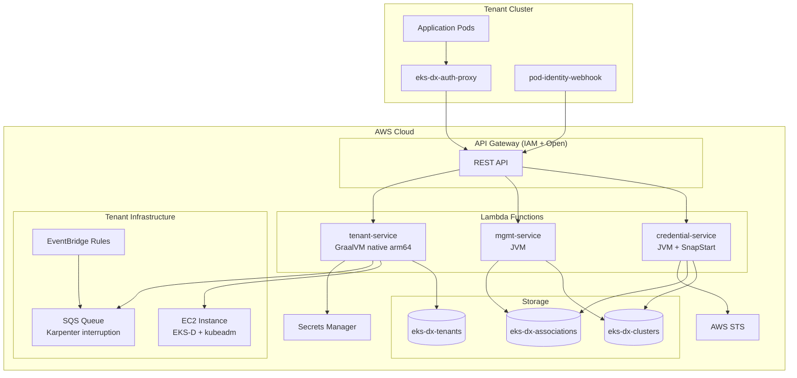
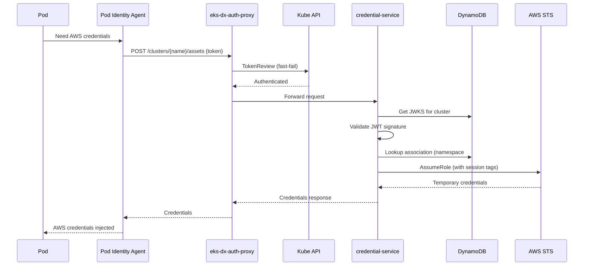
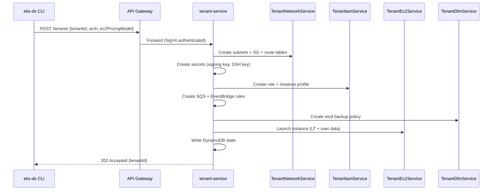

# Architecture

## System Overview

EKS-DX Control Plane is a serverless service that brings EKS Pod Identity to non-EKS Kubernetes clusters (EKS-D via kubeadm). It consists of three Lambda functions, two in-cluster containers, a native CLI, and a CDK infrastructure stack.

## Deployment Topology

## Request Flows

### Credential Exchange (Hot Path)

### Tenant Provisioning

## Design Patterns

- **Composable services**: Tenant provisioning split into Network, IAM, EC2, DLM services
- **SSM as interface**: Terraform writes params, Lambda reads at runtime
- **Per-tenant isolation**: Dedicated subnets, SG, IAM role, SQS queue per tenant
- **Dual validation**: Proxy does TokenReview (fast-fail), Lambda does JWKS (authoritative)
- **Event-driven interruption**: EventBridge → SQS → Karpenter handles spot reclaims
