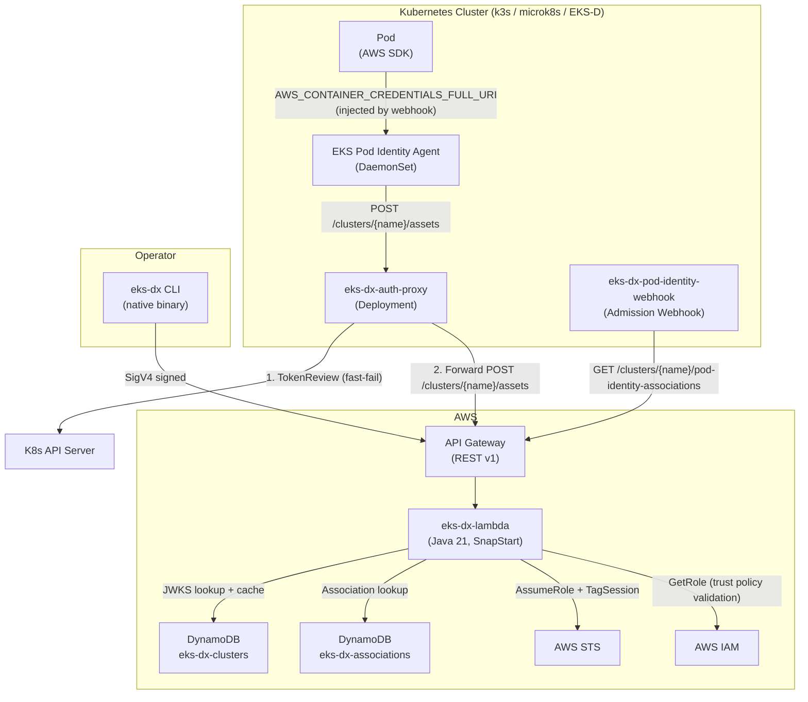
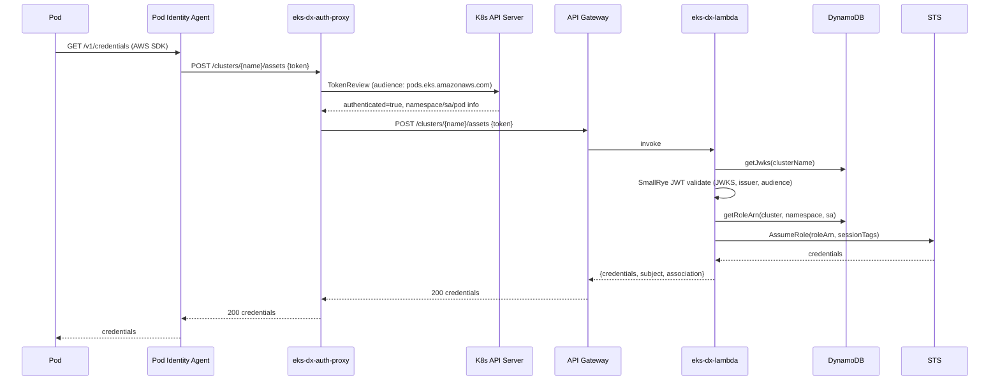
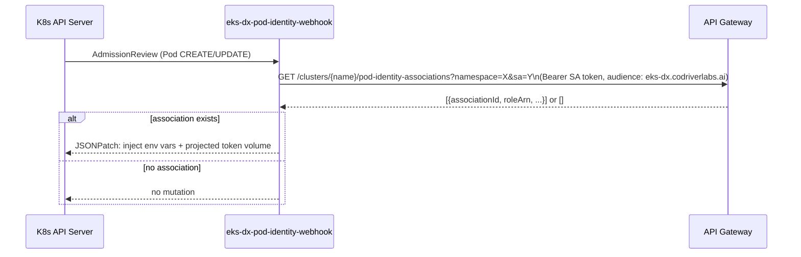

# Architecture

## System Overview

EKS-DX extends EKS Pod Identity to non-EKS Kubernetes clusters. It replicates the `AssumeRoleForPodIdentity` API contract so that the standard EKS Pod Identity Agent can work against k3s, microk8s, and EKS-D clusters without modification.

## High-Level Architecture

## Authentication Flow (Credential Exchange)

## Webhook Mutation Flow

## Design Principles

- **Wire compatibility**: The proxy and Lambda expose the same `/clusters/{name}/assets` endpoint as the real EKS Pod Identity Agent API, so the standard agent DaemonSet works unmodified.
- **Defense in depth**: Two-stage token validation — Kubernetes TokenReview (fast-fail in-cluster) + independent JWKS validation in Lambda.
- **Stateless Lambda**: All state in DynamoDB; Lambda is stateless and benefits from SnapStart for cold-start reduction.
- **Least privilege**: STS `AssumeRole` is scoped to `arn:aws:iam::*:role/eks-dx-pod-*`; management endpoints require IAM SigV4.
- **JWKS caching**: 5-minute in-memory TTL per cluster per audience to avoid DynamoDB reads on every token validation.
