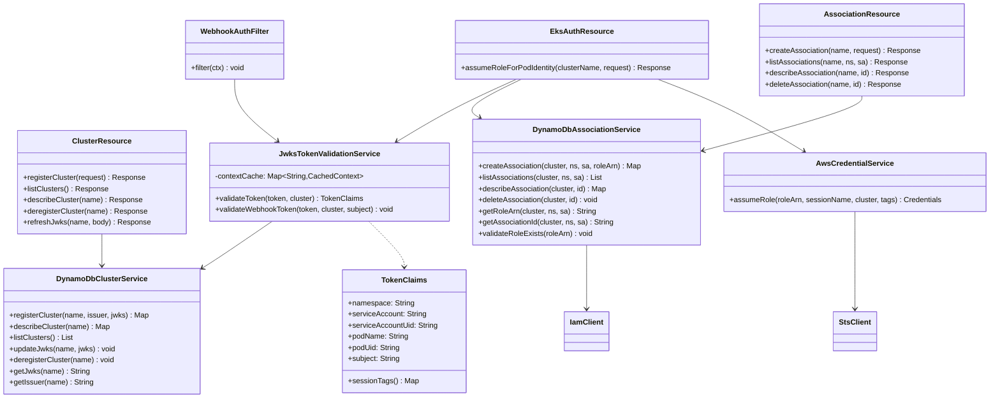
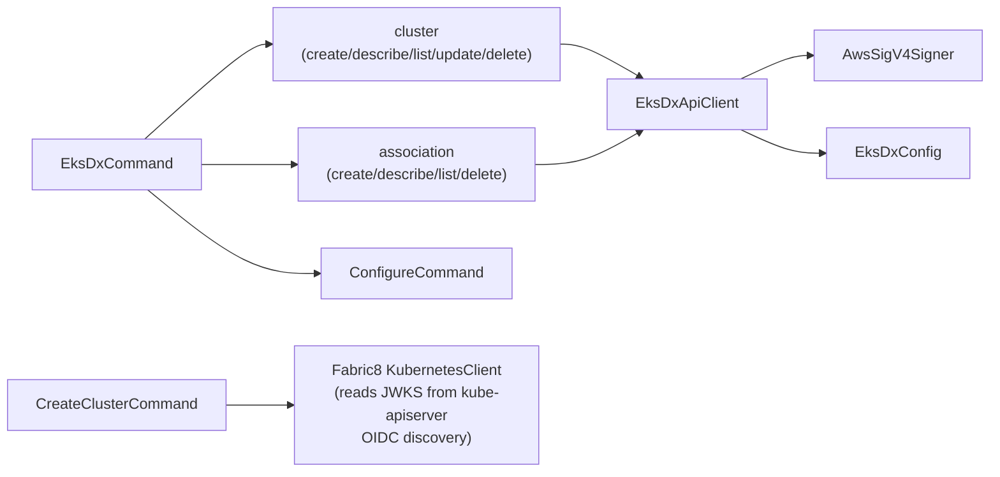

# Components

## eks-dx-lambda

The serverless backend. Runs as an AWS Lambda function behind API Gateway.

**Key behaviors:**
- `WebhookAuthFilter` only intercepts `GET /clusters/{name}/pod-identity-associations` with a `Bearer` token; all other auth is handled by API Gateway IAM or the token-in-body pattern.
- `JwksTokenValidationService` caches `JWTAuthContextInfo` per `clusterName|audience` with a 5-minute TTL.
- `DynamoDbAssociationService.validateRoleExists()` calls IAM `GetRole` and checks the trust policy for `sts:AssumeRole` or `sts:*` before creating an association.
- STS `AssumeRole` always adds `eks-cluster-name` tag plus Kubernetes metadata tags (`kubernetes-namespace`, `kubernetes-service-account`, `kubernetes-pod-name`, `kubernetes-pod-uid`).

---

## eks-dx-auth-proxy

In-cluster Quarkus service. Runs as a Deployment. Exposes the same API surface as the EKS Pod Identity Agent.

| Class | Responsibility |
|-------|---------------|
| `EksAuthAgentResource` | Handles `POST /clusters/{name}/assets` and `/clusters/{name}/assume-role-for-pod-identity` |
| `TokenValidationService` | Calls Kubernetes TokenReview API (Fabric8); extracts namespace/sa/pod from status |
| `LambdaForwardingService` | Forwards the original request body to the Lambda API Gateway endpoint via JDK `HttpClient` |
| `HealthResource` | `/health/live` and `/health/ready` endpoints |

**Key behaviors:**
- TokenReview is submitted with audience `pods.eks.amazonaws.com`.
- Pod name/UID are extracted from `extra["authentication.kubernetes.io/pod-name"]` and `pod-uid` in the TokenReview response.
- On TokenReview rejection, returns 400 immediately without calling Lambda.
- Prometheus metrics exposed via Micrometer.

---

## eks-dx-pod-identity-webhook

Kubernetes MutatingAdmissionWebhook. Runs as a Deployment. Uses JOSDK Webhooks framework.

| Class | Responsibility |
|-------|---------------|
| `WebhookEndpoint` | `POST /mutate` — delegates to `PodIdentityMutator.controller()` |
| `PodIdentityMutator` | Injects `AWS_CONTAINER_CREDENTIALS_FULL_URI`, `AWS_CONTAINER_AUTHORIZATION_TOKEN_FILE`, and projected token volume into all containers |
| `LambdaAssociationLookup` | Queries Lambda API for associations; authenticates with a projected SA token (audience `eks-dx.codriverlabs.ai`) |

**Injected values:**
- `AWS_CONTAINER_CREDENTIALS_FULL_URI` = `http://169.254.170.23/v1/credentials`
- `AWS_CONTAINER_AUTHORIZATION_TOKEN_FILE` = `/var/run/secrets/pods.eks.amazonaws.com/serviceaccount/eks-pod-identity-token`
- Volume: projected `ServiceAccountToken` with audience `pods.eks.amazonaws.com`, expiry 86400s, path `eks-pod-identity-token`

**Key behavior:** Idempotent — checks for existing env vars and volumes before injecting to avoid duplicates.

---

## eks-dx-cli

Native binary (GraalVM). Manages clusters and associations via the Lambda API.

**Config resolution order** (`EksDxConfig`): CLI flag → `EKS_DX_ENDPOINT` / `AWS_REGION` env vars → `~/.eks-dx/config` → defaults (`https://eks-dx.codriverlabs.ai`, `us-east-1`).

`CreateClusterCommand` auto-discovers the cluster issuer and JWKS by querying the kube-apiserver's OIDC discovery endpoint (`/.well-known/openid-configuration` and `/openid/v1/jwks`).

---

## infra

CDK app (`InfraApp` → `EksDxStack`). Provisions the same resources as `sam.yaml` plus:
- DynamoDB PITR (`pointInTimeRecovery: true`)
- `RemovalPolicy.RETAIN` on both tables
- JSON-format API Gateway access logs
