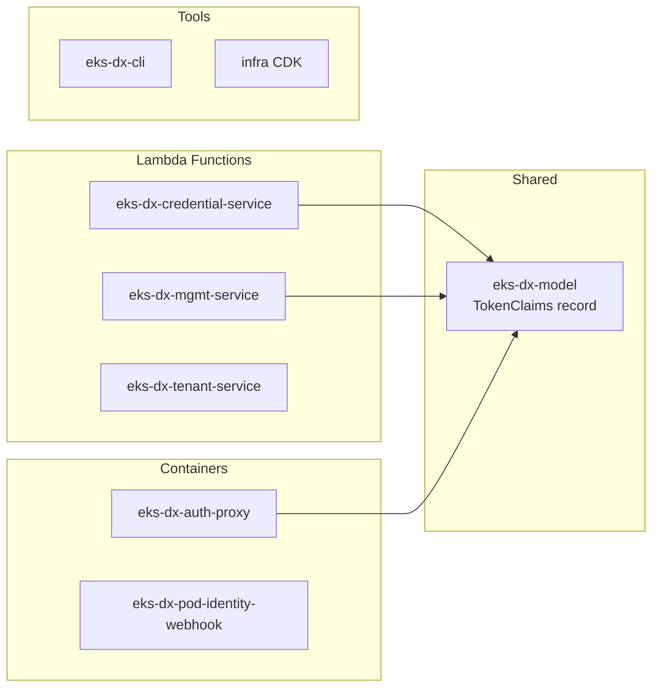

# Components

## Module Map

## eks-dx-credential-service

**Purpose**: Credential exchange — validates pod tokens and returns temporary AWS credentials.

| Class | Responsibility |
|-------|---------------|
| `EksAuthResource` | REST endpoint `POST /clusters/{name}/assets` |
| `JwksTokenValidationService` | JWT validation via DynamoDB-cached JWKS (5-min TTL) |
| `AwsCredentialService` | STS AssumeRole with session tags from token claims |

**Runtime**: Lambda, JVM, SnapStart. Memory: 512MB. Timeout: 30s.

## eks-dx-mgmt-service

**Purpose**: Cluster and association CRUD management.

| Class | Responsibility |
|-------|---------------|
| `ClusterResource` | REST: register/list/describe/deregister clusters, refresh JWKS |
| `AssociationResource` | REST: create/list/describe/delete pod identity associations |
| `DynamoDbClusterService` | DynamoDB CRUD for clusters table |
| `DynamoDbAssociationService` | DynamoDB CRUD for associations table + IAM role validation |
| `JwksTokenValidationService` | Validates webhook Bearer tokens |
| `WebhookAuthFilter` | JAX-RS filter for Bearer token auth on GET associations |

**Runtime**: Lambda, JVM. Memory: 256MB. Timeout: 30s.

## eks-dx-tenant-service

**Purpose**: Tenant EC2 instance lifecycle (provision, deprovision, hibernate, resume).

| Class | Responsibility |
|-------|---------------|
| `TenantResource` | REST: `POST /tenants`, `GET /tenants/{id}`, `DELETE /tenants/{id}` |
| `TenantStreamResource` | SSE: `GET /tenants/{id}/stream` (provisioning progress) |
| `TenantProvisioningService` | Orchestrator — delegates to composable services |
| `TenantNetworkService` | Per-tenant subnets, SG, route table associations |
| `TenantIamService` | IAM role, 5 managed policies, inline policy, instance profile |
| `TenantEc2Service` | EC2 launch, user data injection, Elastic IP |
| `TenantDlmService` | DLM policy for daily etcd volume snapshots |

**Runtime**: Lambda, GraalVM native arm64. Memory: 128MB. Timeout: 900s. Function URL (SSE).

## eks-dx-auth-proxy

**Purpose**: In-cluster proxy that validates tokens via Kubernetes TokenReview then forwards to Lambda.

| Class | Responsibility |
|-------|---------------|
| `EksAuthAgentResource` | REST endpoint matching Pod Identity Agent protocol |
| `TokenValidationService` | Kubernetes TokenReview API call + claim extraction |
| `EksDxCredentialServiceClient` | HTTP forwarding to Lambda via API Gateway |

**Deployment**: Container image (Jib), Kubernetes Deployment + Service.

## eks-dx-pod-identity-webhook

**Purpose**: Mutating admission webhook that injects env vars and projected token volumes into pods.

| Class | Responsibility |
|-------|---------------|
| `WebhookEndpoint` | Admission webhook HTTP endpoint |
| `PodIdentityMutator` | Pod mutation logic (env vars + volume injection) |
| `LambdaAssociationLookup` | Checks if namespace/SA has an association via Lambda |

**Deployment**: Container image (Jib), Kubernetes Deployment + MutatingWebhookConfiguration.

## eks-dx-cli

**Purpose**: Native CLI for cluster, association, and tenant management.

| Class | Responsibility |
|-------|---------------|
| `EksDxCommand` | Picocli root command |
| `Create/List/Describe/Delete*Command` | Subcommands for each resource type |
| `CreateTenantCommand` | Tenant provisioning with SSE progress streaming |
| `EksDxApiClient` | HTTP client with SigV4 signing |
| `AwsSigV4Signer` | AWS Signature V4 implementation |
| `EksDxConfig` | Config file management (~/.eks-dx/config) |

**Output**: Native binary `eks-dx` (GraalVM).

## infra (CDK)

**Purpose**: AWS infrastructure as code.

| Class | Responsibility |
|-------|---------------|
| `InfraApp` | CDK app entry point |
| `EksDxStack` | Full stack: 3 Lambdas, 3 DynamoDB tables, API Gateway, IAM, CloudWatch |

**Deployment**: `cdk deploy` from `infra/` directory.
