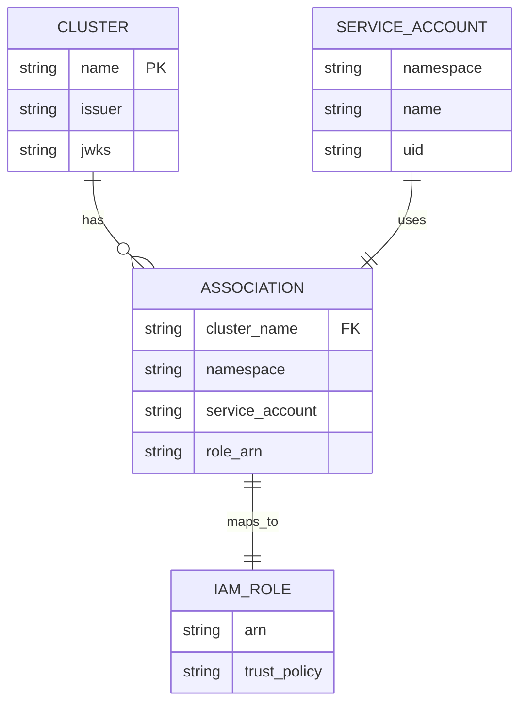

# Data Models and Structures

## Core Data Models

### Authentication Models

#### TokenClaims Record
```java
public record TokenClaims(
    String subject,           // system:serviceaccount:namespace:service-account
    String namespace,         // Kubernetes namespace
    String serviceAccount,    // Service account name
    String podName,          // Pod name (optional)
    String podUid,           // Pod UID (optional)
    String serviceAccountUid, // Service account UID
    Instant expiration,      // Token expiration time
    Map<String, String> sessionTags // AWS session tags
) {
    public Map<String, String> sessionTags() {
        // Generate session tags from Kubernetes metadata
    }
}
```

#### AgentRequest/Response Models
```java
// Request from pod to authentication service
public class AgentRequest {
    private String clusterName;
    private String token;
}

// Response with AWS credentials
public class AgentResponse {
    private SubjectDto subject;
    private AssumedRoleUserDto assumedRoleUser;
    private CredentialsDto credentials;
}

public class CredentialsDto {
    private String accessKeyId;
    private String secretAccessKey;
    private String sessionToken;
    private Instant expiration;
}
```

### Management Models

#### Cluster Registration Models
```java
public class RegisterClusterRequest {
    private String name;        // Cluster identifier
    private String issuer;      // OIDC issuer URL
    private String jwks;        // JSON Web Key Set
}

public class ClusterInfo {
    private String name;
    private String issuer;
    private String jwks;
    private Instant createdAt;
    private Instant updatedAt;
}
```

#### Association Models
```java
public class CreateAssociationRequest {
    private String clusterName;
    private String namespace;
    private String serviceAccount;
    private String roleArn;
}

public class AssociationInfo {
    private String associationId;
    private String clusterName;
    private String namespace;
    private String serviceAccount;
    private String roleArn;
    private Instant createdAt;
}
```

## Database Schema

### DynamoDB Table Structures

#### Clusters Table Schema
```mermaid
erDiagram
    CLUSTERS {
        string PK "CLUSTER#name"
        string SK "METADATA"
        string Name "Cluster name"
        string Issuer "OIDC issuer URL"
        string Jwks "JSON Web Key Set"
        timestamp CreatedAt "Creation timestamp"
        timestamp UpdatedAt "Last update timestamp"
    }
```

**Access Patterns:**
- Get cluster by name: `PK = CLUSTER#name AND SK = METADATA`
- List all clusters: `begins_with(PK, "CLUSTER#")`

#### Associations Table Schema
```mermaid
erDiagram
    ASSOCIATIONS {
        string PK "CLUSTER#name"
        string SK "ASSOCIATION#namespace#serviceaccount"
        string AssociationId "UUID identifier"
        string ClusterName "Cluster name"
        string Namespace "Kubernetes namespace"
        string ServiceAccount "Service account name"
        string RoleArn "IAM role ARN"
        timestamp CreatedAt "Creation timestamp"
    }
```

**Access Patterns:**
- Get association: `PK = CLUSTER#name AND SK = ASSOCIATION#ns#sa`
- List cluster associations: `PK = CLUSTER#name AND begins_with(SK, "ASSOCIATION#")`
- Filter by namespace: `PK = CLUSTER#name AND begins_with(SK, "ASSOCIATION#namespace#")`

### Data Relationships



## Configuration Data Models

### CLI Configuration Model
```java
public class EksDxConfig {
    private String endpoint;    // API Gateway URL
    private String region;      // AWS region
    
    public static Path configFile() {
        return Paths.get(System.getProperty("user.home"), ".eks-dx", "config");
    }
}
```

### Application Configuration
```java
// Quarkus configuration properties
@ConfigMapping(prefix = "eks-dx")
public interface EksDxConfiguration {
    String clustersTable();      // DynamoDB clusters table
    String associationsTable();  // DynamoDB associations table
}

@ConfigMapping(prefix = "aws.sts")
public interface StsConfiguration {
    Duration sessionDuration();  // STS session duration
}
```

## JWT Token Data Models

### JWKS (JSON Web Key Set) Structure
```json
{
  "keys": [
    {
      "kty": "RSA",
      "use": "sig",
      "kid": "key-id-1",
      "n": "base64-encoded-modulus",
      "e": "AQAB",
      "alg": "RS256"
    }
  ]
}
```

### Service Account Token Structure
```json
{
  "iss": "https://kubernetes.default.svc.cluster.local",
  "aud": ["pods.eks.amazonaws.com"],
  "sub": "system:serviceaccount:namespace:service-account",
  "exp": 1704067200,
  "iat": 1704063600,
  "kubernetes.io": {
    "namespace": "default",
    "serviceaccount": {
      "name": "my-service-account",
      "uid": "abc-def-123"
    },
    "pod": {
      "name": "my-pod-123",
      "uid": "def-ghi-456"
    }
  }
}
```

## AWS Integration Data Models

### STS AssumeRole Request
```java
public class AssumeRoleRequest {
    private String roleArn;
    private String roleSessionName;
    private Integer durationSeconds;
    private List<Tag> tags;           // Session tags from Kubernetes metadata
}

public class Tag {
    private String key;
    private String value;
}
```

### Session Tags Mapping
```java
// Kubernetes metadata → AWS session tags
Map<String, String> sessionTags = Map.of(
    "kubernetes-namespace", tokenClaims.namespace(),
    "kubernetes-service-account", tokenClaims.serviceAccount(),
    "kubernetes-pod-name", tokenClaims.podName(),
    "kubernetes-pod-uid", tokenClaims.podUid(),
    "eks-cluster-name", clusterName
);
```

## Kubernetes Integration Models

### Pod Mutation Models
```java
// Kubernetes Pod specification modifications
public class PodMutation {
    private List<EnvVar> envVars;           // Environment variables to inject
    private List<Volume> volumes;           // Projected token volumes
    private List<VolumeMount> volumeMounts; // Volume mount specifications
}

public class EnvVar {
    private String name;    // AWS_ROLE_ARN, AWS_WEB_IDENTITY_TOKEN_FILE
    private String value;   // Role ARN, token file path
}
```

### TokenReview Models
```java
public class TokenReviewRequest {
    private String token;
    private List<String> audiences;  // ["pods.eks.amazonaws.com"]
}

public class TokenReviewResponse {
    private boolean authenticated;
    private UserInfo user;
    private Map<String, Object> extra;  // Kubernetes metadata
}
```

## Error Models

### API Error Responses
```java
public class ErrorResponse {
    private String error;
    private String message;
    private int status;
    private String timestamp;
}

// Common error types
public enum ErrorType {
    INVALID_TOKEN,
    CLUSTER_NOT_FOUND,
    ASSOCIATION_NOT_FOUND,
    ROLE_NOT_FOUND,
    DUPLICATE_ASSOCIATION,
    VALIDATION_ERROR
}
```

## Data Validation Models

### Input Validation Rules
```java
// Cluster name validation
@Pattern(regexp = "^[a-zA-Z0-9][a-zA-Z0-9-_]*[a-zA-Z0-9]$")
private String clusterName;

// IAM role ARN validation
@Pattern(regexp = "^arn:aws:iam::[0-9]{12}:role/.*$")
private String roleArn;

// Kubernetes namespace validation
@Pattern(regexp = "^[a-z0-9]([-a-z0-9]*[a-z0-9])?$")
private String namespace;
```

### Business Logic Constraints
- **Cluster Names**: Must be unique across the system
- **Associations**: One association per cluster/namespace/service-account combination
- **Role ARNs**: Must exist and have proper trust policies
- **Token Audience**: Must match `pods.eks.amazonaws.com`
- **Session Duration**: Between 15 minutes and 12 hours
