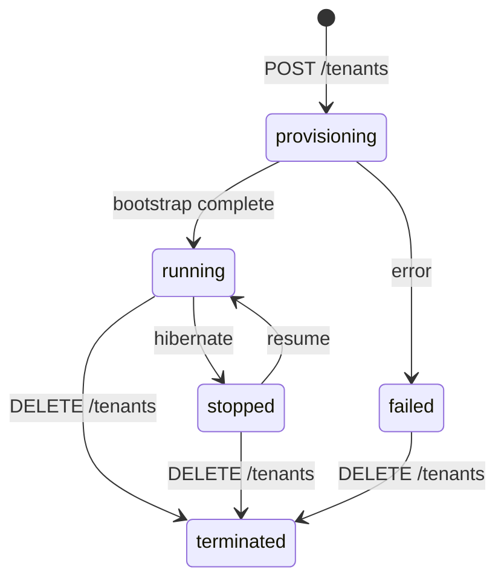

# Data Models

## TokenClaims (eks-dx-model)

Shared record extracted from validated JWT tokens.

```java
public record TokenClaims(
    String subject,           // "system:serviceaccount:namespace:sa-name"
    String namespace,         // Kubernetes namespace
    String serviceAccount,    // Service account name
    String podName,           // Pod name (from claims)
    String podUid,            // Pod UID
    String serviceAccountUid, // SA UID
    Map<String, String> sessionTags  // Passed to STS AssumeRole
) {}
```

## DynamoDB Key Design

### Clusters Table
```
┌─────────────────────────────────────────────┐
│ PK: clusterName                             │
├─────────────────────────────────────────────┤
│ issuer: "https://oidc.eks-dx.example.com"   │
│ jwks: "{\"keys\":[...]}"                    │
│ createdAt: "2026-05-25T..."                 │
└─────────────────────────────────────────────┘
```

### Associations Table (Composite Key)
```
┌──────────────────────────────────────────────────────────┐
│ PK: CLUSTER#my-cluster  │  SK: default#my-service-account│
├──────────────────────────────────────────────────────────┤
│ roleArn: "arn:aws:iam::123:role/eks-dx-pod-my-role"      │
│ associationId: "uuid-..."                                │
│ createdAt: "2026-05-25T..."                              │
└──────────────────────────────────────────────────────────┘
```

**Access patterns**:
- `GetItem(PK, SK)` → O(1) role ARN lookup during credential exchange
- `Query(PK)` → all associations for a cluster
- `Scan(filter: associationId=X)` → describe by ID (no GSI)

### Tenants Table
```
┌─────────────────────────────────────────────┐
│ PK: tenantId                                │
├─────────────────────────────────────────────┤
│ instanceId: "i-0abc123..."                  │
│ state: "running|provisioning|stopped"       │
│ phase: "EC2 instance launched"              │
│ progress: 0-100                             │
│ publicIp: "1.2.3.4"                         │
│ sshKeySecretArn: "arn:aws:secretsmanager:." │
│ updatedAt: "2026-05-25T..."                 │
│ error: null | "error message"               │
└─────────────────────────────────────────────┘
```

## Tenant Instance State Machine



## IAM Role Structure (Per-Tenant)

```
eks-dx-tenant-{tenantId}-instance-role
├── Managed Policies:
│   ├── AmazonSSMManagedInstanceCore
│   ├── AmazonEC2ContainerRegistryPullOnly
│   ├── AmazonEKS_CNI_Policy
│   ├── AmazonEBSCSIDriverEKSClusterScopedPolicy
│   └── CloudWatchAgentServerPolicy
└── Inline Policy (eks-dx-tenant-policy):
    ├── SecretsAccess (tenant-scoped)
    ├── EksDxApiInvoke (cluster-scoped)
    ├── TenantStateUpdate (DynamoDB, tenant-scoped)
    ├── SSMAndECRAndCloudWatch (*)
    ├── EKSCNI (*)
    ├── KarpenterRead (*)
    ├── KarpenterWrite (cluster-tag-scoped)
    ├── KarpenterDelete (cluster-tag-scoped)
    ├── KarpenterPassRole (self)
    ├── KarpenterSQS (queue-scoped)
    ├── CloudProviderRead (*)
    └── CloudProviderWriteTagged (cluster-tag-scoped)
```
