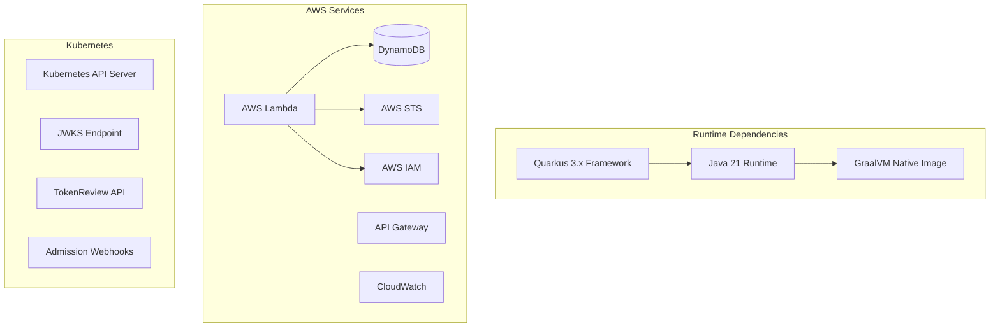

# Dependencies and External Integrations

## Technology Stack Overview



## Core Framework Dependencies

### Quarkus Framework
- **Version**: 3.x (latest stable)
- **Purpose**: Cloud-native Java framework for microservices
- **Key Features**:
  - Fast startup times and low memory usage
  - Native compilation support with GraalVM
  - Reactive programming model
  - Container-first approach
  - Hot reload for development

### Java Runtime
- **Version**: Java 21 (LTS)
- **Purpose**: Primary programming language and runtime
- **Key Features**:
  - Records for immutable data classes
  - Pattern matching and switch expressions
  - Virtual threads (Project Loom)
  - Improved garbage collection

## AWS SDK Dependencies

### AWS SDK for Java v2
```xml
<dependency>
    <groupId>software.amazon.awssdk</groupId>
    <artifactId>dynamodb</artifactId>
</dependency>
<dependency>
    <groupId>software.amazon.awssdk</groupId>
    <artifactId>sts</artifactId>
</dependency>
<dependency>
    <groupId>software.amazon.awssdk</groupId>
    <artifactId>iam</artifactId>
</dependency>
```

**Usage Patterns**:
- **DynamoDB**: Cluster and association data persistence
- **STS**: Temporary credential generation via AssumeRole
- **IAM**: Role validation and trust policy checking

### AWS Service Integration Details

#### DynamoDB Integration
- **Tables**: `eks-dx-clusters`, `eks-dx-associations`
- **Billing Mode**: PAY_PER_REQUEST (on-demand)
- **Features Used**:
  - Query operations for efficient lookups
  - Conditional writes for duplicate prevention
  - Point-in-time recovery (PITR) in CDK deployment

#### STS Integration
- **Operations**: AssumeRole for credential exchange
- **Session Tags**: Kubernetes metadata propagation
- **Session Duration**: Configurable (default: 1 hour)
- **Features Used**:
  - Temporary credential generation
  - Cross-account role assumption support
  - Session tagging for audit trails

## Authentication and Security Dependencies

### jose4j Library
```xml
<dependency>
    <groupId>org.bitbucket.b_c</groupId>
    <artifactId>jose4j</artifactId>
</dependency>
```

**Purpose**: JWT token validation and JWKS processing
**Key Features**:
- JWT signature verification
- JWKS (JSON Web Key Set) parsing
- RSA and ECDSA signature algorithms
- Token claim extraction and validation

### Security Integration Patterns
- **JWKS Caching**: In-memory caching of public keys
- **Token Validation**: Multi-stage JWT verification
- **Signature Algorithms**: RS256, ES256 support
- **Audience Validation**: Strict audience checking

## HTTP Client Dependencies

### JDK HttpClient
- **Version**: Built into Java 21
- **Purpose**: HTTP communication for all external API calls
- **Usage**:
  - CLI to Lambda API communication
  - Proxy to Lambda forwarding
  - Webhook to Lambda association checks
  - JWKS endpoint discovery

### HTTP Client Patterns
```java
// Async HTTP client usage
HttpClient client = HttpClient.newBuilder()
    .connectTimeout(Duration.ofSeconds(10))
    .build();

HttpRequest request = HttpRequest.newBuilder()
    .uri(URI.create(endpoint))
    .header("Authorization", "Bearer " + token)
    .POST(HttpRequest.BodyPublishers.ofString(json))
    .build();

CompletableFuture<HttpResponse<String>> response = 
    client.sendAsync(request, HttpResponse.BodyHandlers.ofString());
```

## Kubernetes Client Dependencies

### Fabric8 Kubernetes Client
```xml
<dependency>
    <groupId>io.fabric8</groupId>
    <artifactId>kubernetes-client</artifactId>
</dependency>
```

**Purpose**: Kubernetes API integration
**Usage**:
- TokenReview API calls for token validation
- JWKS endpoint discovery from Kubernetes API
- Cluster configuration and authentication

### Kubernetes Integration Patterns
- **TokenReview**: Fast-fail token validation
- **Service Account Tokens**: Projected token handling
- **OIDC Discovery**: Automatic JWKS endpoint discovery
- **Cluster Authentication**: In-cluster and external cluster support

## Command Line Interface Dependencies

### Picocli Framework
```xml
<dependency>
    <groupId>info.picocli</groupId>
    <artifactId>picocli</artifactId>
</dependency>
```

**Purpose**: Command-line interface framework
**Features**:
- Annotation-based command definition
- Subcommand support
- Auto-completion generation
- Help text generation
- Type conversion and validation

### CLI Patterns
```java
@Command(name = "eks-dx", subcommands = {
    CreateCommand.class,
    DeleteCommand.class,
    ListCommand.class,
    DescribeCommand.class
})
public class EksDxCommand implements Runnable {
    // Command implementation
}
```

## Build and Development Dependencies

### Maven Build System
```xml
<properties>
    <maven.compiler.source>21</maven.compiler.source>
    <maven.compiler.target>21</maven.compiler.target>
    <quarkus.platform.version>3.x.x</quarkus.platform.version>
</properties>
```

### GraalVM Native Image
- **Purpose**: Native binary compilation for CLI
- **Benefits**:
  - Fast startup times (< 100ms)
  - Low memory usage (< 50MB)
  - No JVM dependency for deployment
- **Configuration**: Reflection and resource configuration files

### Container Image Dependencies
```xml
<dependency>
    <groupId>io.quarkus</groupId>
    <artifactId>quarkus-container-image-docker</artifactId>
</dependency>
```

**Features**:
- Multi-stage Docker builds
- Distroless base images
- JVM and native image variants
- Automatic image tagging and pushing

## Testing Dependencies

### JUnit 5 and Mockito
```xml
<dependency>
    <groupId>org.junit.jupiter</groupId>
    <artifactId>junit-jupiter</artifactId>
    <scope>test</scope>
</dependency>
<dependency>
    <groupId>org.mockito</groupId>
    <artifactId>mockito-core</artifactId>
    <scope>test</scope>
</dependency>
```

### WireMock for HTTP Mocking
```xml
<dependency>
    <groupId>com.github.tomakehurst</groupId>
    <artifactId>wiremock-jre8</artifactId>
    <scope>test</scope>
</dependency>
```

**Usage**: Mock external HTTP services for testing
- Kubernetes API server mocking
- Lambda API mocking for CLI tests
- JWKS endpoint mocking

### DynamoDB Local for Integration Testing
```bash
docker run -d -p 18000:8000 \
  public.ecr.aws/aws-dynamodb-local/aws-dynamodb-local:latest
```

**Purpose**: Local DynamoDB instance for integration tests
**Benefits**:
- No AWS account required for testing
- Fast test execution
- Consistent test environment

## Infrastructure Dependencies

### AWS CDK
```xml
<dependency>
    <groupId>software.amazon.awscdk</groupId>
    <artifactId>aws-cdk-lib</artifactId>
</dependency>
```

**Purpose**: Infrastructure as Code for AWS resources
**Resources Managed**:
- Lambda functions with SnapStart
- DynamoDB tables with PITR
- API Gateway with IAM authentication
- CloudWatch alarms and dashboards
- IAM roles and policies

### SAM (Serverless Application Model)
```yaml
# sam.yaml
AWSTemplateFormatVersion: '2010-09-09'
Transform: AWS::Serverless-2016-10-31
```

**Purpose**: Alternative deployment method for serverless components
**Benefits**:
- Simplified Lambda deployment
- Local testing with SAM CLI
- CloudFormation integration
- Built-in best practices

## External Service Dependencies

### AWS Services
| Service | Purpose | Billing Model |
|---------|---------|---------------|
| Lambda | Core authentication service | Pay per request |
| DynamoDB | Data persistence | On-demand billing |
| API Gateway | HTTP API management | Pay per request |
| STS | Credential exchange | No additional cost |
| IAM | Role validation | No additional cost |
| CloudWatch | Monitoring and logging | Pay per usage |

### Kubernetes Services
| Service | Purpose | Availability |
|---------|---------|--------------|
| TokenReview API | Token validation | All Kubernetes versions |
| OIDC Discovery | JWKS endpoint discovery | Kubernetes 1.20+ |
| Admission Webhooks | Pod mutation | Kubernetes 1.16+ |
| Projected Tokens | Service account tokens | Kubernetes 1.20+ |

## Version Compatibility Matrix

| Component | Minimum Version | Recommended Version |
|-----------|----------------|-------------------|
| Java | 21 | 21 (LTS) |
| Quarkus | 3.0 | 3.x (latest) |
| Kubernetes | 1.20 | 1.28+ |
| AWS SDK | 2.20 | 2.x (latest) |
| Maven | 3.8 | 3.9+ |
| GraalVM | 22.3 | 23.x (latest) |

## Dependency Management Patterns

### Maven BOM Usage
```xml
<dependencyManagement>
    <dependencies>
        <dependency>
            <groupId>io.quarkus.platform</groupId>
            <artifactId>quarkus-bom</artifactId>
            <version>${quarkus.platform.version}</version>
            <type>pom</type>
            <scope>import</scope>
        </dependency>
    </dependencies>
</dependencyManagement>
```

### Security Updates
- **Automated Dependency Updates**: Dependabot configuration
- **Security Scanning**: Regular vulnerability assessments
- **Version Pinning**: Exact versions for reproducible builds
- **Update Strategy**: Regular updates with testing validation
