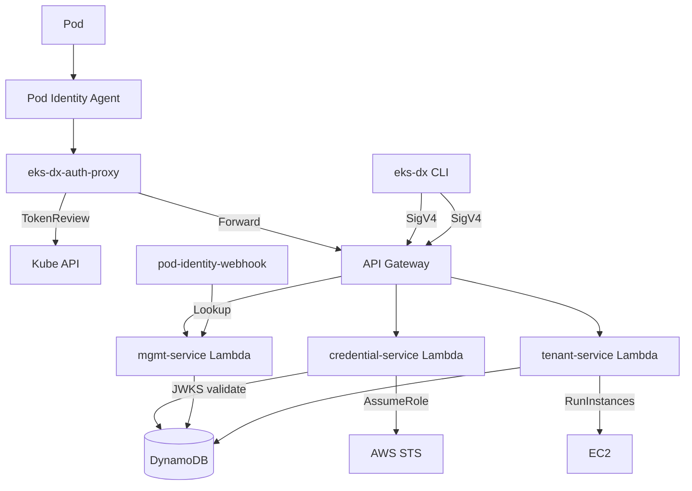

# Knowledge Base Index

> **For AI Assistants**: This file is the primary entry point. Read this first to understand what documentation exists and where to find detailed information.

## How to Use This Documentation

1. **Start here** — scan the table below to find which file answers your question
2. **Read the relevant file** — each file is self-contained for its topic
3. **Cross-reference** — files link to each other where topics overlap

## Documentation Map

| File | Purpose | Consult When... |
|------|---------|-----------------|
| [codebase_info.md](codebase_info.md) | Tech stack, modules, versions | You need project metadata or dependency versions |
| [architecture.md](architecture.md) | System design, request flows, deployment topology | You need to understand how components interact |
| [components.md](components.md) | Module responsibilities, key classes | You need to find where specific logic lives |
| [interfaces.md](interfaces.md) | REST APIs, DynamoDB schemas, SSM contracts | You need API signatures, request/response formats |
| [data_models.md](data_models.md) | DynamoDB tables, key design, token claims | You need to understand data structures |
| [workflows.md](workflows.md) | Provisioning flow, credential exchange, deployment | You need step-by-step process understanding |
| [dependencies.md](dependencies.md) | External libraries, AWS services, versions | You need to check what's available or upgrade paths |
| [review_notes.md](review_notes.md) | Gaps, inconsistencies, improvement areas | You need to know what's incomplete or risky |

## Architecture Summary (Quick Reference)

## Module Ownership

- **Credential exchange** (hot path): `eks-dx-credential-service` — SnapStart, <100ms p99
- **Management API**: `eks-dx-mgmt-service` — cluster/association CRUD
- **Tenant provisioning**: `eks-dx-tenant-service` — EC2 lifecycle, IAM, networking
- **In-cluster**: `eks-dx-auth-proxy` + `eks-dx-pod-identity-webhook` — deployed as containers
- **CLI**: `eks-dx-cli` — native binary, SigV4 signing, config management
- **Infrastructure**: `infra/` — CDK stack (Lambda, DynamoDB, API Gateway, IAM)

## Key Design Decisions

1. **Three separate Lambdas** (not one monolith) — different scaling/memory/timeout profiles
2. **SnapStart on credential-service** — hot path needs <100ms cold start
3. **Native on tenant-service** — 15-min timeout for provisioning, low memory
4. **DynamoDB single-table per concern** — clusters table, associations table, tenants table
5. **SSM Parameter Store** as interface between Terraform/CDK infra and Lambda runtime
6. **Per-tenant network isolation** — dedicated subnets + security groups
