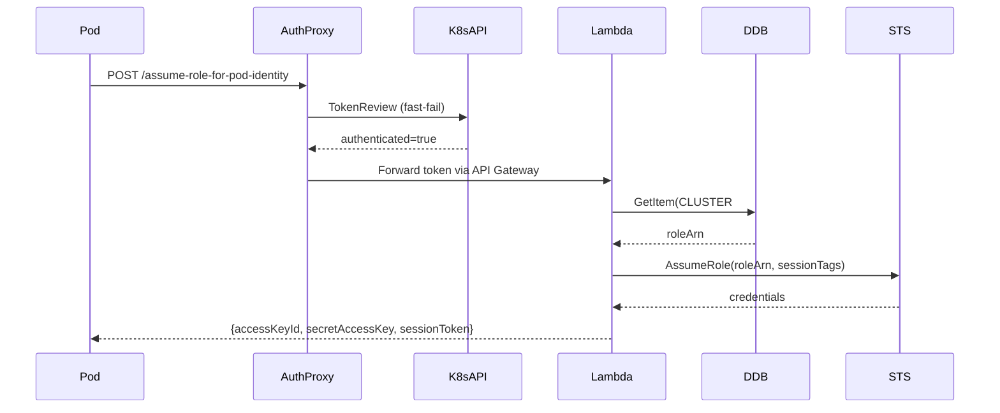

# Workflows

## Credential Exchange (Hot Path)



## Tenant Provisioning (with Rollback)

Steps tracked in `ProvisionedResources` for compensating cleanup:

1. **Network** — Create public + private subnets (auto-indexed CIDR), associate route tables (`eks-dx-infra-public-rt`, `eks-dx-infra-private-rt`), create security group
2. **Secrets** — SA signing key + SSH key pair in Secrets Manager
3. **IAM** — Tenant role + instance profile with inline policy
4. **SQS/EventBridge** — Interruption queue + spot termination rules
5. **DLM** — Daily etcd backup policy (retain 3)
6. **EC2** — Launch instance with user data
7. **DynamoDB** — Write tenant state

On failure at any step: rollback in reverse order (best-effort, each step independently try/caught).

## Build

```bash
./build-local.sh                           # All modules, JVM
./build-local.sh --only tenant --native    # Single module, native
./build-local.sh --only tenant,cli --native --skip-tests
```

Modules: `credential`, `mgmt`, `tenant`, `auth-proxy`, `webhook`, `cli`, `cdk`

## Deploy

```bash
./deploy-local.sh                          # Build + deploy
./deploy-local.sh --skip-build             # Reuse existing zips
./deploy-local.sh --context jvmTenant=true # JVM mode (fast iteration)
./deploy-local.sh --context nativeArch=x86 # x86 native
```

## Architecture Selection (CDK Context)

| Host Arch | Build Flag | CDK Context | Lambda Arch |
|-----------|-----------|-------------|-------------|
| arm64 | `--native` | (default) | ARM_64 |
| x86_64 | `--native` | `nativeArch=x86` | X86_64 |
| any | (none) | `jvmTenant=true` | X86_64 (JVM) |
