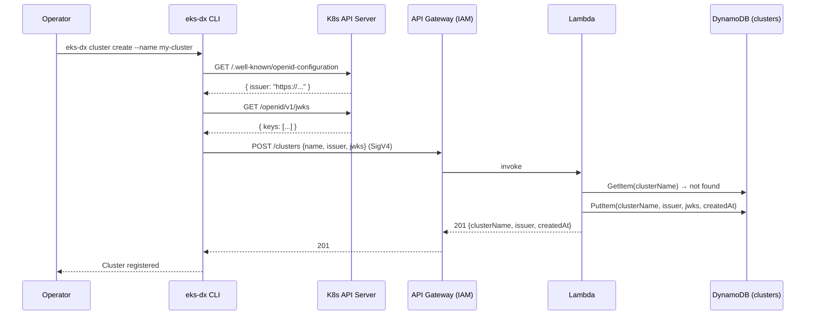
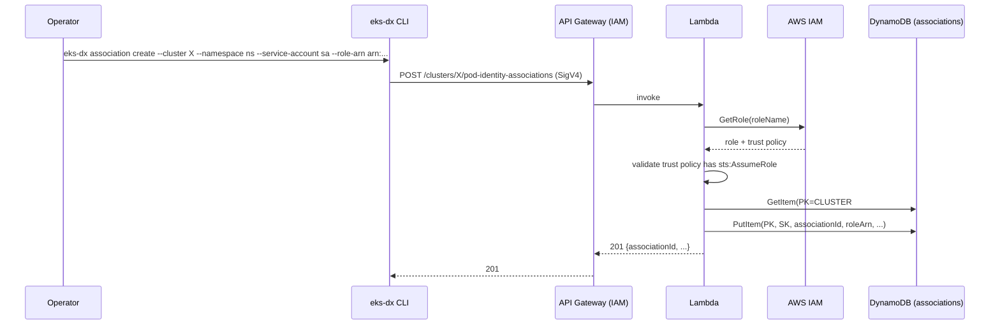
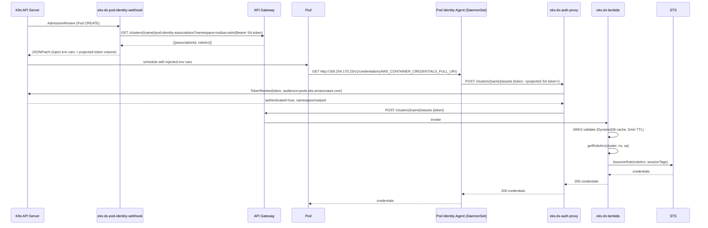

# Workflows

## 1. Cluster Registration



## 2. Pod Identity Association Creation



## 3. Pod Startup (Full Flow)



## 4. JWKS Refresh

When cluster keys rotate:
```
eks-dx cluster update my-cluster --refresh-jwks
```
CLI fetches fresh JWKS from kube-apiserver and calls `PUT /clusters/{name}/jwks`. Lambda updates the DynamoDB item. The in-memory cache in Lambda expires within 5 minutes.

## 5. CI/CD Integration

Pods can use the proxy directly as a credential provider:
```bash
export AWS_CONTAINER_CREDENTIALS_FULL_URI=http://eks-dx-auth-proxy:8080/clusters/{name}/assets
export AWS_CONTAINER_AUTHORIZATION_TOKEN="Bearer $(cat /var/run/secrets/kubernetes.io/serviceaccount/token)"
# AWS SDK now resolves credentials via the proxy
aws s3 ls
```
