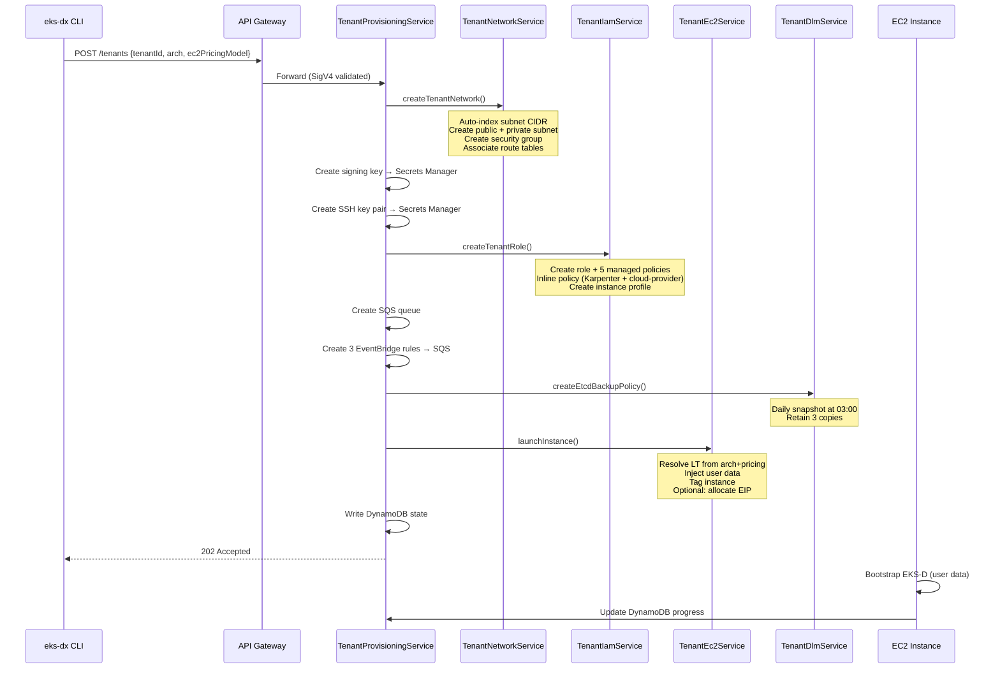
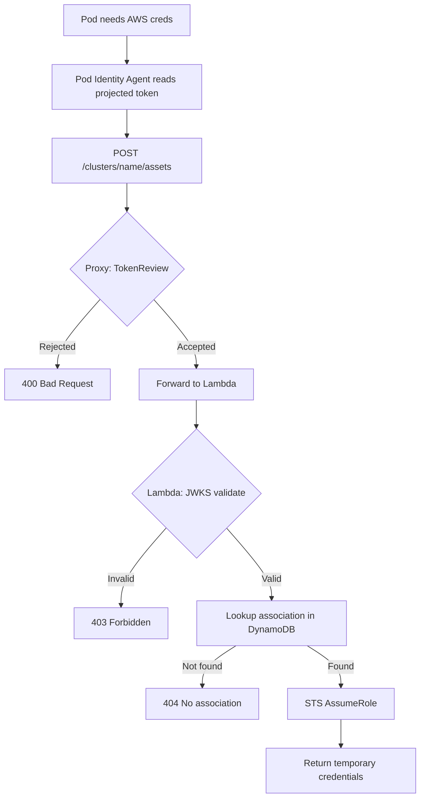
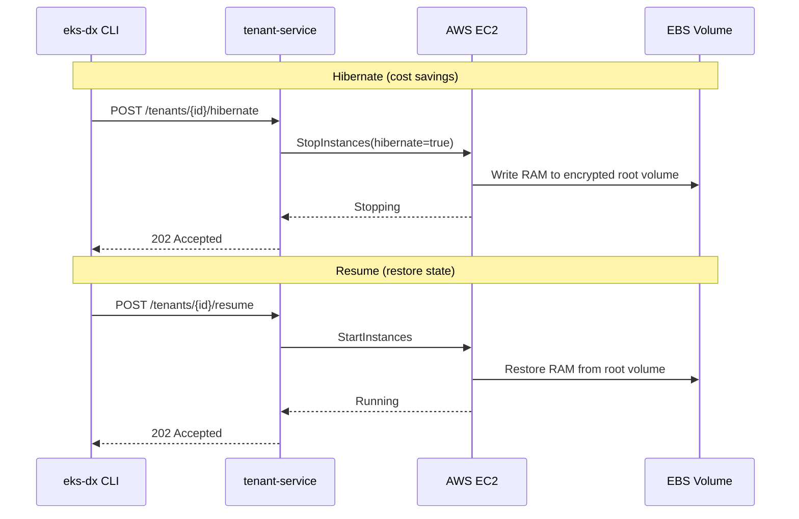
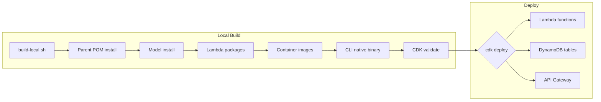
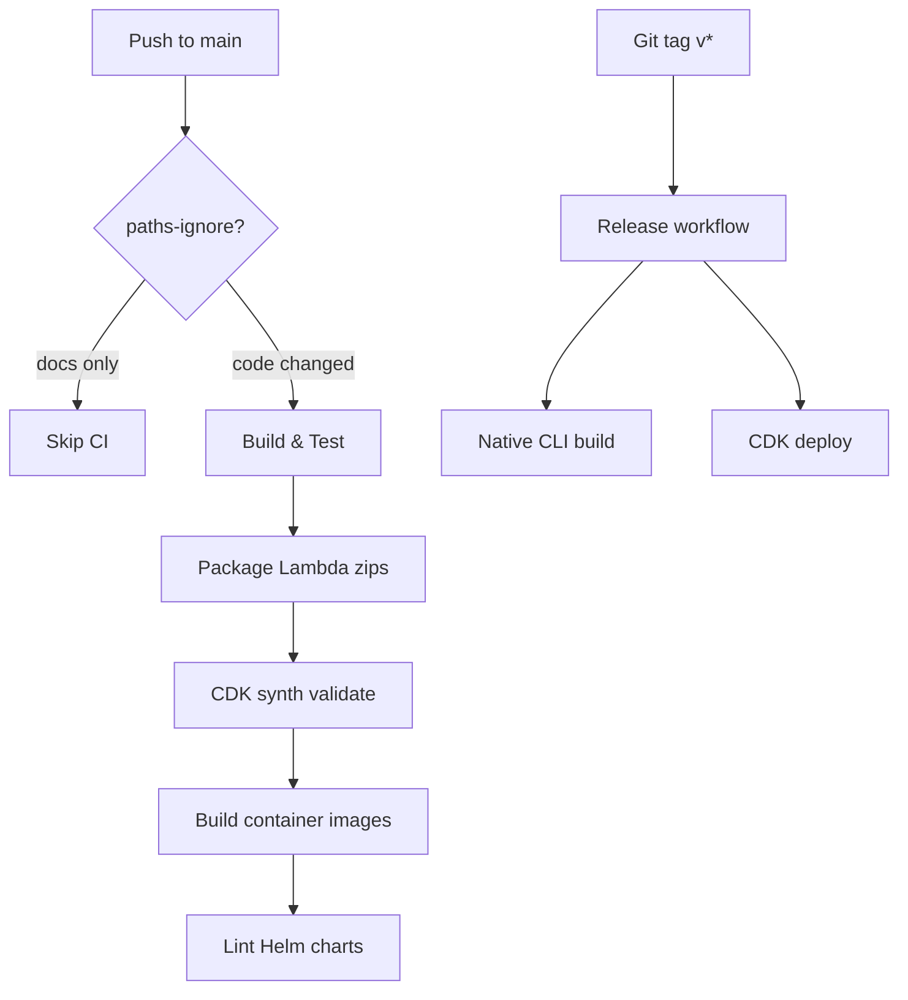

# Workflows

## Tenant Provisioning (Full Flow)

```mermaid
sequenceDiagram
    participant User as eks-dx CLI
    participant API as API Gateway
    participant Orch as TenantProvisioningService
    participant Net as TenantNetworkService
    participant IAM as TenantIamService
    participant EC2 as TenantEc2Service
    participant DLM as TenantDlmService
    participant Instance as EC2 Instance

    User->>API: POST /tenants {tenantId, arch, ec2PricingModel}
    API->>Orch: Forward (SigV4 validated)
    
    Orch->>Net: createTenantNetwork()
    Note over Net: Auto-index subnet CIDR<br/>Create public + private subnet<br/>Create security group<br/>Associate route tables
    
    Orch->>Orch: Create signing key → Secrets Manager
    Orch->>Orch: Create SSH key pair → Secrets Manager
    
    Orch->>IAM: createTenantRole()
    Note over IAM: Create role + 5 managed policies<br/>Inline policy (Karpenter + cloud-provider)<br/>Create instance profile
    
    Orch->>Orch: Create SQS queue
    Orch->>Orch: Create 3 EventBridge rules → SQS
    
    Orch->>DLM: createEtcdBackupPolicy()
    Note over DLM: Daily snapshot at 03:00<br/>Retain 3 copies
    
    Orch->>EC2: launchInstance()
    Note over EC2: Resolve LT from arch+pricing<br/>Inject user data<br/>Tag instance<br/>Optional: allocate EIP
    
    Orch->>Orch: Write DynamoDB state
    Orch-->>User: 202 Accepted
    
    Instance->>Instance: Bootstrap EKS-D (user data)
    Instance->>Orch: Update DynamoDB progress
```

## Credential Exchange (Runtime)

```mermaid
flowchart TD
    A[Pod needs AWS creds] --> B[Pod Identity Agent reads projected token]
    B --> C[POST /clusters/name/assets]
    C --> D{Proxy: TokenReview}
    D -->|Rejected| E[400 Bad Request]
    D -->|Accepted| F[Forward to Lambda]
    F --> G{Lambda: JWKS validate}
    G -->|Invalid| H[403 Forbidden]
    G -->|Valid| I[Lookup association in DynamoDB]
    I -->|Not found| J[404 No association]
    I -->|Found| K[STS AssumeRole]
    K --> L[Return temporary credentials]
```

## Tenant Hibernate/Resume

```mermaid
sequenceDiagram
    participant User as eks-dx CLI
    participant Lambda as tenant-service
    participant EC2 as AWS EC2
    participant EBS as EBS Volume

    Note over User,EBS: Hibernate (cost savings)
    User->>Lambda: POST /tenants/{id}/hibernate
    Lambda->>EC2: StopInstances(hibernate=true)
    EC2->>EBS: Write RAM to encrypted root volume
    EC2-->>Lambda: Stopping
    Lambda-->>User: 202 Accepted

    Note over User,EBS: Resume (restore state)
    User->>Lambda: POST /tenants/{id}/resume
    Lambda->>EC2: StartInstances
    EC2->>EBS: Restore RAM from root volume
    EC2-->>Lambda: Running
    Lambda-->>User: 202 Accepted
```

## Build and Deploy

```mermaid
flowchart LR
    subgraph "Local Build"
        A[build-local.sh] --> B[Parent POM install]
        B --> C[Model install]
        C --> D[Lambda packages]
        D --> E[Container images]
        E --> F[CLI native binary]
        F --> G[CDK validate]
    end
    
    subgraph "Deploy"
        G --> H{cdk deploy}
        H --> I[Lambda functions]
        H --> J[DynamoDB tables]
        H --> K[API Gateway]
    end
```

## CI/CD Pipeline

```mermaid
flowchart TD
    Push[Push to main] --> CI{paths-ignore?}
    CI -->|docs only| Skip[Skip CI]
    CI -->|code changed| Build[Build & Test]
    Build --> Package[Package Lambda zips]
    Package --> Synth[CDK synth validate]
    Synth --> Images[Build container images]
    Images --> Helm[Lint Helm charts]
    
    Tag[Git tag v*] --> Release[Release workflow]
    Release --> Native[Native CLI build]
    Release --> Deploy[CDK deploy]
```
