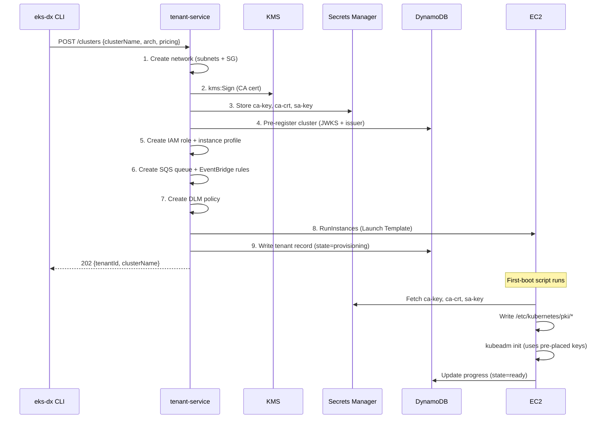
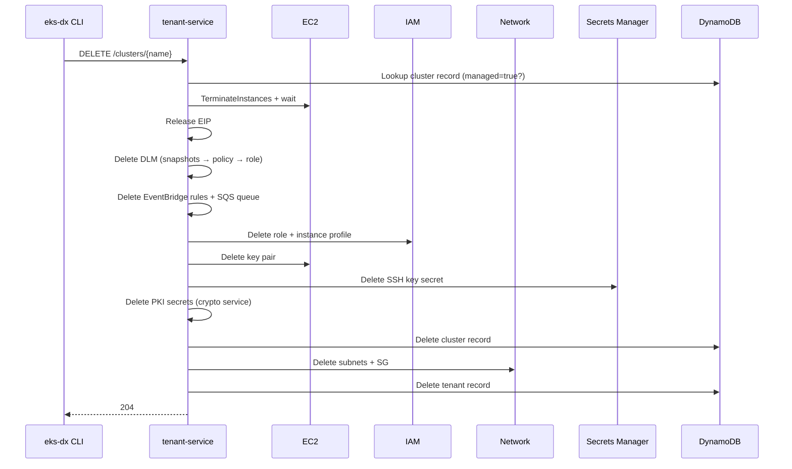
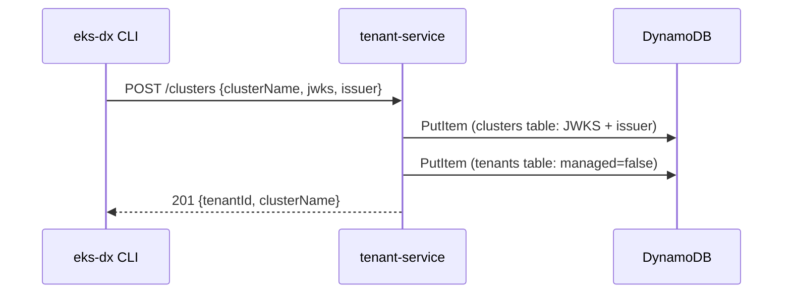

# Workflows

## Managed Cluster Provisioning

## Managed Cluster Deletion

## Rollback on Provisioning Failure

If any step fails during provisioning, `ProvisionedResources` tracks what was created. Rollback happens in reverse order:

1. Terminate EC2 instance (wait for termination)
2. Release EIP
3. Delete DLM policy
4. Delete EventBridge rules + SQS queue
5. Delete IAM role + instance profile
6. Delete key pair
7. Delete SSH key secret
8. Delete PKI secrets (TenantCryptoService.deleteSecrets)
9. Delete pre-registered cluster from DynamoDB
10. Delete network (TenantNetworkService — also does internal cleanup on partial failure)

## Self-Managed Cluster Registration

## Credential Exchange (Hot Path)

1. Pod calls eks-pod-identity-agent (DaemonSet, intercepts 169.254.170.23)
2. Agent calls eks-dx-auth-proxy (in-cluster, kube-system)
3. Proxy does Kubernetes TokenReview (fast-fail: validates JWT signature + audience)
4. Proxy forwards to credential-service Lambda (API Gateway)
5. Lambda validates JWT via JWKS (DynamoDB-cached, 5-min TTL per cluster|audience)
6. Lambda looks up association: `PK=CLUSTER#<name>`, `SK=<namespace>#<serviceAccount>`
7. Lambda calls STS AssumeRole with session tags from token claims
8. Returns temporary AWS credentials to pod

## Network Allocation

- VPC: `10.0.0.0/16` (shared)
- Shared infra subnet: `10.0.0.0/24`
- Per-tenant public subnet: `10.0.<index>.0/24` (index auto-incremented)
- Per-tenant private subnet: `10.0.<100+index>.0/24`
- Control plane IP: `10.0.<index>.5` (static within public subnet)
