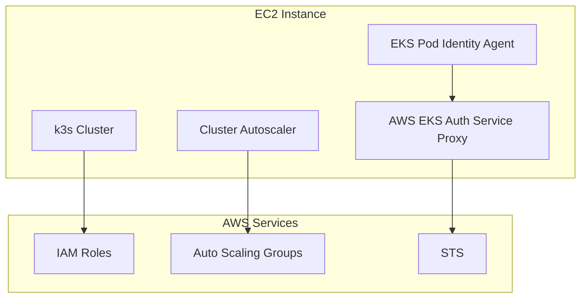

# k3s on EC2 with EKS Pod Identity Integration

This guide sets up k3s on a single EC2 instance with EKS Pod Identity Agent and Cluster Autoscaler support, using our AWS EKS Auth Service Proxy.

## Overview



## Prerequisites

- AWS CLI v2 installed and configured
- EC2 instance with Ubuntu 22.04 LTS
- Instance type: t3.medium or larger (2 vCPU, 4GB RAM minimum)
- Security group allowing inbound traffic on ports 6443 (k3s API) and 80/443 (applications)

## Step 1: IAM Roles and Policies

### 1.1 Create EC2 Instance Profile Role

```bash
# Create the EC2 instance role
aws iam create-role \
  --role-name k3s-ec2-instance-role \
  --assume-role-policy-document file://ec2-trust-policy.json

# Create trust policy file
cat > ec2-trust-policy.json << 'EOF'
{
  "Version": "2012-10-17",
  "Statement": [
    {
      "Effect": "Allow",
      "Principal": {
        "Service": "ec2.amazonaws.com"
      },
      "Action": "sts:AssumeRole"
    }
  ]
}
EOF
```

### 1.2 Create and Attach EC2 Instance Policy

```bash
# Create the instance policy
aws iam create-policy \
  --policy-name k3s-ec2-instance-policy \
  --policy-document file://ec2-instance-policy.json

# Create policy document
cat > ec2-instance-policy.json << 'EOF'
{
  "Version": "2012-10-17",
  "Statement": [
    {
      "Effect": "Allow",
      "Action": [
        "autoscaling:DescribeAutoScalingGroups",
        "autoscaling:DescribeAutoScalingInstances",
        "autoscaling:DescribeLaunchConfigurations",
        "autoscaling:DescribeTags",
        "autoscaling:SetDesiredCapacity",
        "autoscaling:TerminateInstanceInAutoScalingGroup",
        "ec2:DescribeInstances",
        "ec2:DescribeRegions",
        "ec2:DescribeRouteTables",
        "ec2:DescribeSecurityGroups",
        "ec2:DescribeSubnets",
        "ec2:DescribeVolumes",
        "ec2:CreateSecurityGroup",
        "ec2:CreateTags",
        "ec2:CreateVolume",
        "ec2:ModifyInstanceAttribute",
        "ec2:ModifyVolume",
        "ec2:AttachVolume",
        "ec2:AuthorizeSecurityGroupIngress",
        "ec2:CreateRoute",
        "ec2:DeleteRoute",
        "ec2:DeleteSecurityGroup",
        "ec2:DeleteVolume",
        "ec2:DetachVolume",
        "ec2:RevokeSecurityGroupIngress",
        "ec2:DescribeVpcs",
        "elasticloadbalancing:AddTags",
        "elasticloadbalancing:AttachLoadBalancerToSubnets",
        "elasticloadbalancing:ApplySecurityGroupsToLoadBalancer",
        "elasticloadbalancing:CreateLoadBalancer",
        "elasticloadbalancing:CreateLoadBalancerPolicy",
        "elasticloadbalancing:CreateLoadBalancerListeners",
        "elasticloadbalancing:ConfigureHealthCheck",
        "elasticloadbalancing:DeleteLoadBalancer",
        "elasticloadbalancing:DeleteLoadBalancerListeners",
        "elasticloadbalancing:DescribeLoadBalancers",
        "elasticloadbalancing:DescribeLoadBalancerAttributes",
        "elasticloadbalancing:DetachLoadBalancerFromSubnets",
        "elasticloadbalancing:DeregisterInstancesFromLoadBalancer",
        "elasticloadbalancing:ModifyLoadBalancerAttributes",
        "elasticloadbalancing:RegisterInstancesWithLoadBalancer",
        "elasticloadbalancing:SetLoadBalancerPoliciesForBackendServer",
        "elasticloadbalancing:AddTags",
        "elasticloadbalancing:CreateListener",
        "elasticloadbalancing:CreateTargetGroup",
        "elasticloadbalancing:DeleteListener",
        "elasticloadbalancing:DeleteTargetGroup",
        "elasticloadbalancing:DescribeListeners",
        "elasticloadbalancing:DescribeLoadBalancerPolicies",
        "elasticloadbalancing:DescribeTargetGroups",
        "elasticloadbalancing:DescribeTargetHealth",
        "elasticloadbalancing:ModifyListener",
        "elasticloadbalancing:ModifyTargetGroup",
        "elasticloadbalancing:RegisterTargets",
        "elasticloadbalancing:SetLoadBalancerPoliciesOfListener",
        "iam:CreateServiceLinkedRole",
        "ecr:GetAuthorizationToken",
        "ecr:BatchCheckLayerAvailability",
        "ecr:GetDownloadUrlForLayer",
        "ecr:GetRepositoryPolicy",
        "ecr:DescribeRepositories",
        "ecr:ListImages",
        "ecr:DescribeImages",
        "ecr:BatchGetImage",
        "ecr:GetLifecyclePolicy",
        "ecr:GetLifecyclePolicyPreview",
        "ecr:ListTagsForResource",
        "ecr:DescribeImageScanFindings",
        "sts:AssumeRole"
      ],
      "Resource": "*"
    }
  ]
}
EOF

# Attach policy to role
aws iam attach-role-policy \
  --role-name k3s-ec2-instance-role \
  --policy-arn arn:aws:iam::$(aws sts get-caller-identity --query Account --output text):policy/k3s-ec2-instance-policy
```

### 1.3 Create Instance Profile

```bash
# Create instance profile
aws iam create-instance-profile \
  --instance-profile-name k3s-ec2-instance-profile

# Add role to instance profile
aws iam add-role-to-instance-profile \
  --instance-profile-name k3s-ec2-instance-profile \
  --role-name k3s-ec2-instance-role
```

### 1.4 Create Application Roles for Pod Identity

```bash
# Create a sample application role
aws iam create-role \
  --role-name k3s-pod-identity-app-role \
  --assume-role-policy-document file://pod-identity-trust-policy.json

# Create trust policy for pod identity
cat > pod-identity-trust-policy.json << 'EOF'
{
  "Version": "2012-10-17",
  "Statement": [
    {
      "Effect": "Allow",
      "Principal": {
        "AWS": "arn:aws:iam::ACCOUNT_ID:role/k3s-ec2-instance-role"
      },
      "Action": "sts:AssumeRole"
    }
  ]
}
EOF

# Replace ACCOUNT_ID with your actual account ID
ACCOUNT_ID=$(aws sts get-caller-identity --query Account --output text)
sed -i "s/ACCOUNT_ID/$ACCOUNT_ID/g" pod-identity-trust-policy.json

# Attach a sample policy (S3 read access)
aws iam attach-role-policy \
  --role-name k3s-pod-identity-app-role \
  --policy-arn arn:aws:iam::aws:policy/AmazonS3ReadOnlyAccess
```

## Step 2: Launch EC2 Instance

### 2.1 Create Security Group

```bash
# Create security group
aws ec2 create-security-group \
  --group-name k3s-cluster-sg \
  --description "Security group for k3s cluster"

# Get security group ID
SG_ID=$(aws ec2 describe-security-groups \
  --group-names k3s-cluster-sg \
  --query 'SecurityGroups[0].GroupId' \
  --output text)

# Allow k3s API server access
aws ec2 authorize-security-group-ingress \
  --group-id $SG_ID \
  --protocol tcp \
  --port 6443 \
  --cidr 0.0.0.0/0

# Allow HTTP/HTTPS for applications
aws ec2 authorize-security-group-ingress \
  --group-id $SG_ID \
  --protocol tcp \
  --port 80 \
  --cidr 0.0.0.0/0

aws ec2 authorize-security-group-ingress \
  --group-id $SG_ID \
  --protocol tcp \
  --port 443 \
  --cidr 0.0.0.0/0

# Allow SSH access
aws ec2 authorize-security-group-ingress \
  --group-id $SG_ID \
  --protocol tcp \
  --port 22 \
  --cidr 0.0.0.0/0
```

### 2.2 Launch Instance

```bash
# Launch EC2 instance
aws ec2 run-instances \
  --image-id ami-0c02fb55956c7d316 \
  --instance-type t3.medium \
  --key-name your-key-pair \
  --security-group-ids $SG_ID \
  --iam-instance-profile Name=k3s-ec2-instance-profile \
  --user-data file://user-data.sh \
  --tag-specifications 'ResourceType=instance,Tags=[{Key=Name,Value=k3s-cluster}]'
```

## Step 3: Instance Setup Script

Create the user-data script:

```bash
cat > user-data.sh << 'EOF'
#!/bin/bash
set -e

# Update system
apt-get update
apt-get install -y curl wget unzip

# Install Docker
curl -fsSL https://get.docker.com -o get-docker.sh
sh get-docker.sh
usermod -aG docker ubuntu

# Install k3s
curl -sfL https://get.k3s.io | INSTALL_K3S_EXEC="--disable traefik --disable servicelb" sh -

# Wait for k3s to be ready
sleep 30

# Set up kubeconfig for ubuntu user
mkdir -p /home/ubuntu/.kube
cp /etc/rancher/k3s/k3s.yaml /home/ubuntu/.kube/config
chown ubuntu:ubuntu /home/ubuntu/.kube/config
chmod 600 /home/ubuntu/.kube/config

# Install kubectl
curl -LO "https://dl.k8s.io/release/$(curl -L -s https://dl.k8s.io/release/stable.txt)/bin/linux/amd64/kubectl"
install -o root -g root -m 0755 kubectl /usr/local/bin/kubectl

# Install helm
curl https://raw.githubusercontent.com/helm/helm/main/scripts/get-helm-3 | bash

echo "k3s installation completed"
EOF
```

## Step 4: Deploy EKS Pod Identity Agent

Deploy the EKS Pod Identity Agent as a DaemonSet:

```bash
# Deploy EKS Pod Identity Agent DaemonSet
kubectl apply -f - << 'EOF'
apiVersion: apps/v1
kind: DaemonSet
metadata:
  name: eks-pod-identity-agent
  namespace: kube-system
  labels:
    app: eks-pod-identity-agent
spec:
  selector:
    matchLabels:
      app: eks-pod-identity-agent
  template:
    metadata:
      labels:
        app: eks-pod-identity-agent
    spec:
      hostNetwork: true
      serviceAccountName: eks-pod-identity-agent
      containers:
      - name: eks-pod-identity-agent
        image: amazon/amazon-eks-pod-identity-agent:latest
        ports:
        - containerPort: 80
          hostPort: 80
          name: proxy
          protocol: TCP
        env:
        - name: EKS_CLUSTER_NAME
          value: "k3s-cluster"
        - name: EKS_POD_IDENTITY_ASSOCIATION_ENDPOINT
          value: "http://eks-auth-proxy.kube-system:8080"
        - name: AWS_REGION
          value: "us-east-1"
        securityContext:
          privileged: true
        volumeMounts:
        - mountPath: /var/run/secrets/kubernetes.io/serviceaccount
          name: kube-api-access
          readOnly: true
      volumes:
      - name: kube-api-access
        projected:
          sources:
          - serviceAccountToken:
              expirationSeconds: 3607
              path: token
          - configMap:
              items:
              - key: ca.crt
                path: ca.crt
              name: kube-root-ca.crt
          - downwardAPI:
              items:
              - fieldRef:
                  apiVersion: v1
                  fieldPath: metadata.namespace
                path: namespace
      tolerations:
      - operator: Exists
---
apiVersion: v1
kind: ServiceAccount
metadata:
  name: eks-pod-identity-agent
  namespace: kube-system
---
apiVersion: rbac.authorization.k8s.io/v1
kind: ClusterRole
metadata:
  name: eks-pod-identity-agent
rules:
- apiGroups: [""]
  resources: ["serviceaccounts", "pods"]
  verbs: ["get", "list", "watch"]
---
apiVersion: rbac.authorization.k8s.io/v1
kind: ClusterRoleBinding
metadata:
  name: eks-pod-identity-agent
roleRef:
  apiGroup: rbac.authorization.k8s.io
  kind: ClusterRole
  name: eks-pod-identity-agent
subjects:
- kind: ServiceAccount
  name: eks-pod-identity-agent
  namespace: kube-system
EOF
```

## Step 5: Deploy AWS EKS Auth Service Proxy

```bash
# Clone the repository
git clone https://github.com/your-org/aws-eks-auth-service-proxy.git
cd aws-eks-auth-service-proxy

# Deploy the service
./deploy.sh --cluster k3s-cluster --region us-east-1

# Verify deployment
kubectl get pods -n kube-system | grep eks-auth-proxy
```

## Step 6: Configure Pod Identity Associations

```bash
# Create a pod identity association using the CLI
./eks-d-auth-cli/target/eks-d-auth-cli-*-runner create \
  --cluster k3s-cluster \
  --namespace default \
  --service-account my-app \
  --role-arn arn:aws:iam::$(aws sts get-caller-identity --query Account --output text):role/k3s-pod-identity-app-role

# Verify the association
kubectl get podidentityassociations -n default
```

## Step 7: Install Cluster Autoscaler

### 7.1 Create Auto Scaling Group (Optional)

If you want true autoscaling, create an ASG:

```bash
# Create launch template
aws ec2 create-launch-template \
  --launch-template-name k3s-worker-template \
  --launch-template-data file://launch-template.json

# Create launch template data
cat > launch-template.json << EOF
{
  "ImageId": "ami-0c02fb55956c7d316",
  "InstanceType": "t3.medium",
  "KeyName": "your-key-pair",
  "SecurityGroupIds": ["$SG_ID"],
  "IamInstanceProfile": {
    "Name": "k3s-ec2-instance-profile"
  },
  "UserData": "$(base64 -w 0 user-data-worker.sh)",
  "TagSpecifications": [
    {
      "ResourceType": "instance",
      "Tags": [
        {
          "Key": "Name",
          "Value": "k3s-worker"
        },
        {
          "Key": "kubernetes.io/cluster/k3s-cluster",
          "Value": "owned"
        }
      ]
    }
  ]
}
EOF

# Create worker node user data
cat > user-data-worker.sh << 'EOF'
#!/bin/bash
set -e

# Update system
apt-get update
apt-get install -y curl

# Get master node IP (replace with actual IP)
MASTER_IP="REPLACE_WITH_MASTER_IP"
K3S_TOKEN="REPLACE_WITH_K3S_TOKEN"

# Install k3s agent
curl -sfL https://get.k3s.io | K3S_URL=https://$MASTER_IP:6443 K3S_TOKEN=$K3S_TOKEN sh -
EOF

# Create Auto Scaling Group
aws autoscaling create-auto-scaling-group \
  --auto-scaling-group-name k3s-workers \
  --launch-template LaunchTemplateName=k3s-worker-template,Version='$Latest' \
  --min-size 0 \
  --max-size 10 \
  --desired-capacity 1 \
  --availability-zones us-east-1a us-east-1b us-east-1c \
  --tags Key=kubernetes.io/cluster/k3s-cluster,Value=owned,PropagateAtLaunch=true
```

### 7.2 Deploy Cluster Autoscaler

```bash
# Create cluster autoscaler deployment
kubectl apply -f - << 'EOF'
apiVersion: apps/v1
kind: Deployment
metadata:
  name: cluster-autoscaler
  namespace: kube-system
  labels:
    app: cluster-autoscaler
spec:
  selector:
    matchLabels:
      app: cluster-autoscaler
  template:
    metadata:
      labels:
        app: cluster-autoscaler
    spec:
      serviceAccountName: cluster-autoscaler
      containers:
      - image: registry.k8s.io/autoscaling/cluster-autoscaler:v1.27.3
        name: cluster-autoscaler
        resources:
          limits:
            cpu: 100m
            memory: 300Mi
          requests:
            cpu: 100m
            memory: 300Mi
        command:
        - ./cluster-autoscaler
        - --v=4
        - --stderrthreshold=info
        - --cloud-provider=aws
        - --skip-nodes-with-local-storage=false
        - --expander=least-waste
        - --node-group-auto-discovery=asg:tag=k8s.io/cluster-autoscaler/enabled,k8s.io/cluster-autoscaler/k3s-cluster
        - --balance-similar-node-groups
        - --skip-nodes-with-system-pods=false
        env:
        - name: AWS_REGION
          value: us-east-1
---
apiVersion: v1
kind: ServiceAccount
metadata:
  name: cluster-autoscaler
  namespace: kube-system
---
apiVersion: rbac.authorization.k8s.io/v1
kind: ClusterRole
metadata:
  name: cluster-autoscaler
rules:
- apiGroups: [""]
  resources: ["events", "endpoints"]
  verbs: ["create", "patch"]
- apiGroups: [""]
  resources: ["pods/eviction"]
  verbs: ["create"]
- apiGroups: [""]
  resources: ["pods/status"]
  verbs: ["update"]
- apiGroups: [""]
  resources: ["endpoints"]
  resourceNames: ["cluster-autoscaler"]
  verbs: ["get", "update"]
- apiGroups: [""]
  resources: ["nodes"]
  verbs: ["watch", "list", "get", "update"]
- apiGroups: [""]
  resources: ["pods", "services", "replicationcontrollers", "persistentvolumeclaims", "persistentvolumes"]
  verbs: ["watch", "list", "get"]
- apiGroups: ["extensions"]
  resources: ["replicasets", "daemonsets"]
  verbs: ["watch", "list", "get"]
- apiGroups: ["policy"]
  resources: ["poddisruptionbudgets"]
  verbs: ["watch", "list"]
- apiGroups: ["apps"]
  resources: ["statefulsets", "replicasets", "daemonsets"]
  verbs: ["watch", "list", "get"]
- apiGroups: ["storage.k8s.io"]
  resources: ["storageclasses", "csinodes", "csidrivers", "csistoragecapacities"]
  verbs: ["watch", "list", "get"]
- apiGroups: ["batch", "extensions"]
  resources: ["jobs"]
  verbs: ["get", "list", "watch", "patch"]
- apiGroups: ["coordination.k8s.io"]
  resources: ["leases"]
  verbs: ["create"]
- apiGroups: ["coordination.k8s.io"]
  resourceNames: ["cluster-autoscaler"]
  resources: ["leases"]
  verbs: ["get", "update"]
---
apiVersion: rbac.authorization.k8s.io/v1
kind: ClusterRoleBinding
metadata:
  name: cluster-autoscaler
roleRef:
  apiGroup: rbac.authorization.k8s.io
  kind: ClusterRole
  name: cluster-autoscaler
subjects:
- kind: ServiceAccount
  name: cluster-autoscaler
  namespace: kube-system
EOF
```

## Step 8: Test the Setup

### 8.1 Create Test Application

```bash
# Create test application with pod identity
kubectl apply -f - << 'EOF'
apiVersion: v1
kind: ServiceAccount
metadata:
  name: my-app
  namespace: default
---
apiVersion: apps/v1
kind: Deployment
metadata:
  name: test-app
  namespace: default
spec:
  replicas: 1
  selector:
    matchLabels:
      app: test-app
  template:
    metadata:
      labels:
        app: test-app
    spec:
      serviceAccountName: my-app
      containers:
      - name: aws-cli
        image: amazon/aws-cli:latest
        command: ["sleep", "3600"]
        env:
        - name: AWS_DEFAULT_REGION
          value: us-east-1
EOF
```

### 8.2 Verify Pod Identity Works

```bash
# Check if pod gets AWS credentials
kubectl exec -it deployment/test-app -- aws sts get-caller-identity

# Should return the assumed role identity
```

### 8.3 Test Cluster Autoscaler

```bash
# Scale up deployment to trigger autoscaling
kubectl scale deployment test-app --replicas=10

# Check autoscaler logs
kubectl logs -n kube-system deployment/cluster-autoscaler
```

## Troubleshooting

### Common Issues

1. **EKS Pod Identity Agent not starting**:
   ```bash
   sudo journalctl -u eks-pod-identity-agent -f
   ```

2. **Auth proxy not responding**:
   ```bash
   kubectl logs -n kube-system deployment/eks-auth-proxy
   ```

3. **Pod identity association not found**:
   ```bash
   kubectl get podidentityassociations -A
   ```

4. **AWS permissions issues**:
   ```bash
   # Check instance profile
   curl http://169.254.169.254/latest/meta-data/iam/security-credentials/
   ```

### Verification Commands

```bash
# Check k3s status
sudo systemctl status k3s

# Check all pods
kubectl get pods -A

# Check pod identity agent
sudo systemctl status eks-pod-identity-agent

# Test AWS access from pod
kubectl run test-pod --image=amazon/aws-cli:latest --rm -it -- aws sts get-caller-identity
```

## Security Considerations

1. **Restrict Security Groups**: Limit access to necessary ports only
2. **Use IAM Roles**: Avoid hardcoded AWS credentials
3. **Network Policies**: Implement Kubernetes network policies
4. **Pod Security Standards**: Enable pod security standards
5. **Regular Updates**: Keep k3s and components updated

## Cost Optimization

1. **Instance Types**: Use appropriate instance types for workload
2. **Spot Instances**: Consider spot instances for non-critical workloads
3. **Auto Scaling**: Configure proper scaling policies
4. **Resource Limits**: Set resource requests and limits on pods

This setup provides a production-ready k3s cluster on EC2 with EKS Pod Identity integration and autoscaling capabilities.
